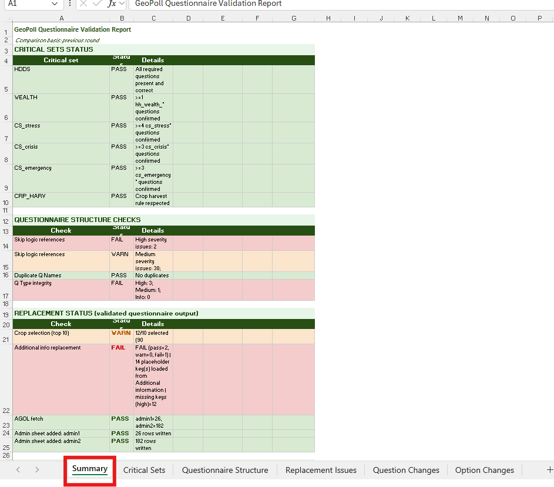
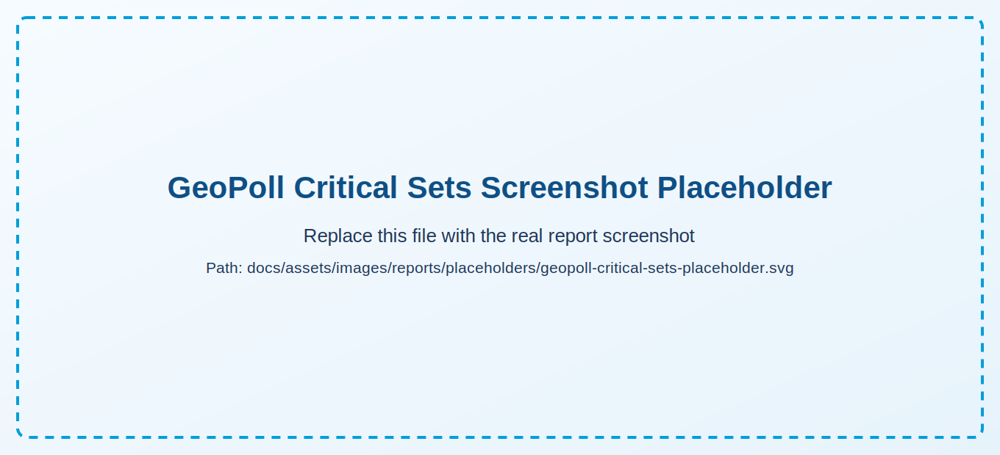
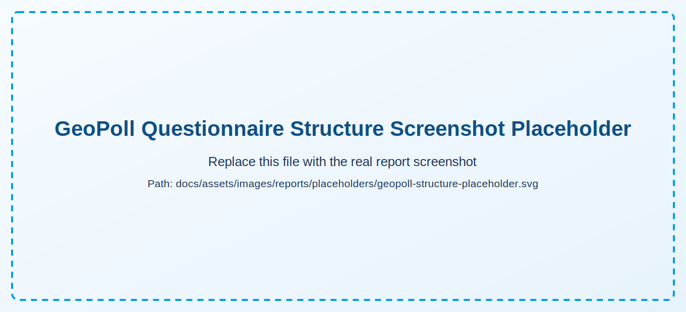
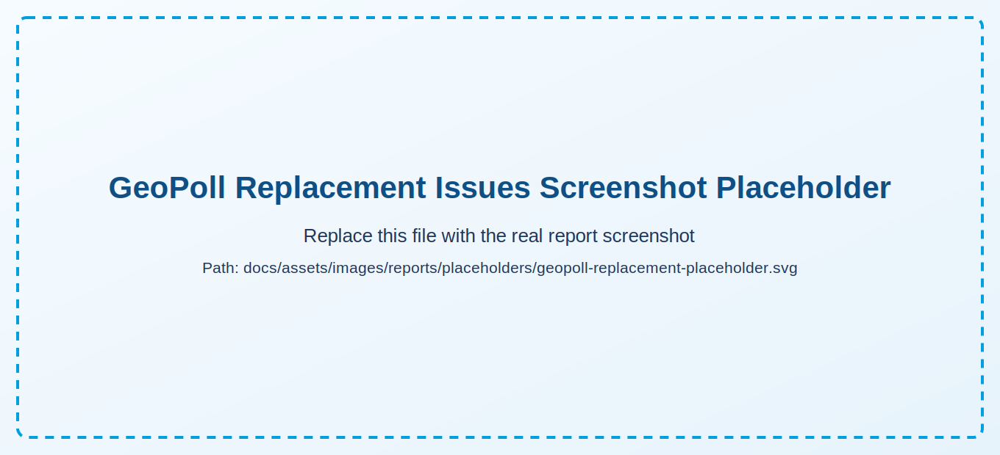
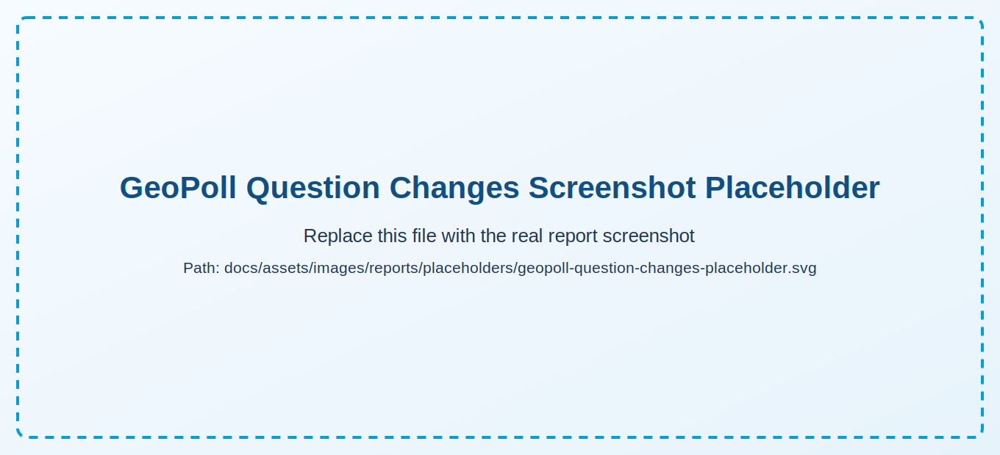
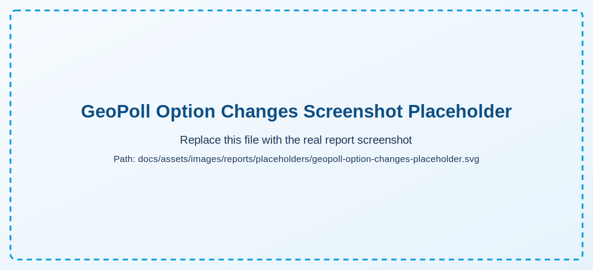

# GeoPoll Report

This page is a compact visual checklist. For deep interpretation, use [GeoPoll Logic](../workflow/geopoll-logic.md).

## Sheet Sequence

1. Summary
2. Critical Sets
3. Questionnaire Structure
4. Replacement Issues
5. Question Changes
6. Option Changes

## Severity Legend

- Blocking issues: HIGH
- Review-required issues: MEDIUM
- Informational differences: INFO

## Placeholders to Replace

<strong>Add real screenshots in:</strong> <code>docs/assets/images/reports/</code>. Suggested names are shown under each placeholder.

### Summary

{: .sheet-placeholder }

Suggested real file: `docs/assets/images/reports/geopoll-summary.png`

### Critical Sets

{: .sheet-placeholder }

Suggested real file: `docs/assets/images/reports/geopoll-critical-sets.png`

### Questionnaire Structure

{: .sheet-placeholder }

Suggested real file: `docs/assets/images/reports/geopoll-structure.png`

### Replacement Issues

{: .sheet-placeholder }

Suggested real file: `docs/assets/images/reports/geopoll-replacement-issues.png`

### Question Changes

{: .sheet-placeholder }

Suggested real file: `docs/assets/images/reports/geopoll-question-changes.png`

### Option Changes

{: .sheet-placeholder }

Suggested real file: `docs/assets/images/reports/geopoll-option-changes.png`
