# KoBo Report - Navigation Guide

The KoBo validator writes a single Excel workbook (e.g. `validation_report_KoBo_EN_<date>.xlsx`) containing the sheets below, in this order.

---

## Report Sheet Overview

| # | Sheet name | What it contains | Read when... |
|---|---|---|---|
| 1 | **Summary** | Severity counts per check group | Always - start here |
| 2 | **Critical Sets** | Mandatory question presence and structural completeness | Summary shows non-PASS |
| 3 | **Questionnaire Structure** | Relevant expressions, Q type, duplicate names, KoBo references | Summary shows non-PASS |
| 4 | **Replacement Issues** | Placeholder token resolution status | Always (previous-round workflow) |
| 5 | **Question Changes** | Presence, mandatory status, labels, and field-level metadata | Summary shows non-PASS |
| 6 | **Choice Changes** | Answer-set drift | Summary shows non-PASS |
| 7 | **[validated questionnaire]** | Filled-in output with replacements applied | Previous-round workflow only |

---

## Column Reference

All detail sheets share the same column layout. Not every column is populated for every row — blank cells mean "not applicable" for that issue type.

| Column | Content |
|---|---|
| **Issue type** | Machine identifier for the issue (e.g. `removed_question`, `broken_relevant_reference`). Matches the identifiers used in the Severity Reference and Logic pages. |
| **Type** | Mandatory category of the affected question: `mandatory`, `mandatory-panel`, or `optional`. Blank for issues not tied to a specific question. |
| **Set** | Critical set name, for rows produced by Critical Sets checks. Blank otherwise. |
| **Q Name** | Question identifier from the XLSForm survey sheet. The same name used in `relevant` expressions and data joins. |
| **Field** | Which column or property was checked (e.g. `relevant`, `mandatory`, `label`, `count`). |
| **Current value** | The value found in the current XLSForm being validated. |
| **Reference / rule** | The baseline value from the reference XLSForm, or the rule being violated. |
| **Action** | Plain-text recommended action for the issue. |
| **Severity** | `HIGH`, `MEDIUM`, `INFO`, or `PASS`. Cells are color-coded: red/orange/blue/green. |
| **Excel row** | Row number in the source XLSForm. Use this to jump directly to the row in the input file. |

---

## 1 - Summary Sheet

The Summary sheet is the entry point. It contains status tables, each covering a check group. Header context lines at the top of the sheet identify the exact run: `Comparison basis`, `Current questionnaire`, `Checked against`, `Language scope`, and `Template used for placeholder mapping`.

**How to read it:**

- Each table row is a sub-check with a status cell on the right.
- Status cells are `PASS` (green), `INFO` (blue), `MEDIUM` (orange), or `HIGH` (red).
- A `HIGH` in any table means the questionnaire should not be launched until that issue is resolved.
- Use the table to decide which detail sheets to open. If everything is `PASS`, you are done.

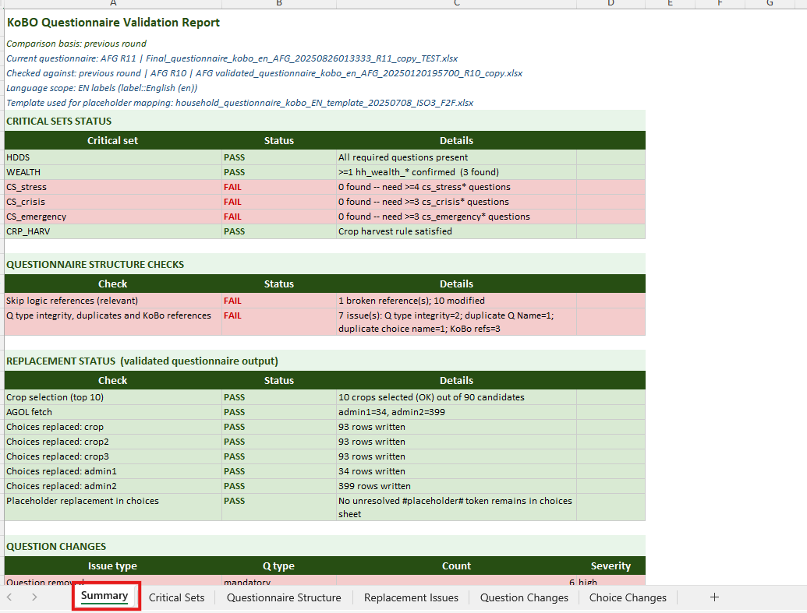

### CRITICAL SETS STATUS

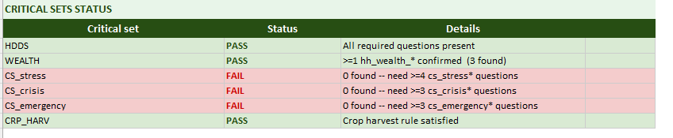

Shows whether all required critical questions are present and correctly flagged as mandatory. Any non-PASS opens the Critical Sets sheet.

### QUESTIONNAIRE STRUCTURE CHECKS

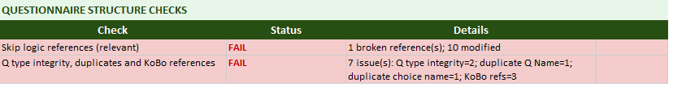

Two rows: one for skip logic references (relevant), one for Q type integrity, duplicates, and KoBo `${var}` syntax. Any HIGH here must be resolved before launch.

### REPLACEMENT STATUS

Summarizes placeholder resolution. In the previous-round workflow, an `INFO` row here tracks Additional Information replacement deltas — not a blocker if the replacement content is correct.

### QUESTION CHANGES

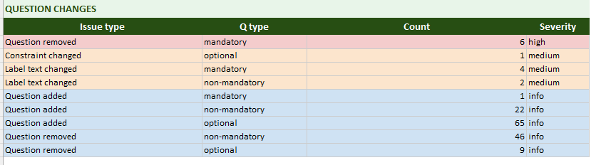

Covers presence changes (added/removed questions), mandatory status, label drift, and field-level metadata (required, constraint, calculation, etc.). HIGH here means a mandatory question is missing or has a structural change.

### CHOICE CHANGES

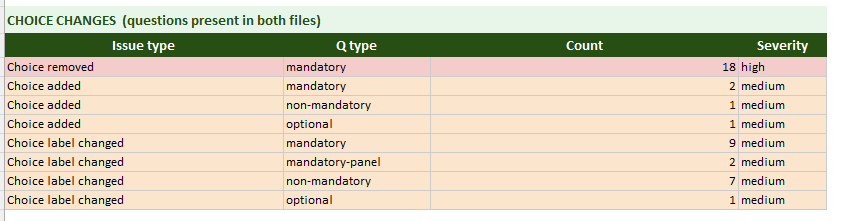

Shows answer-set drift counts. Choice change severities can be HIGH, MEDIUM, or INFO depending on the issue type.

---

## 2 - Critical Sets Sheet

Checks whether all structurally required questions are present and correctly flagged as mandatory.

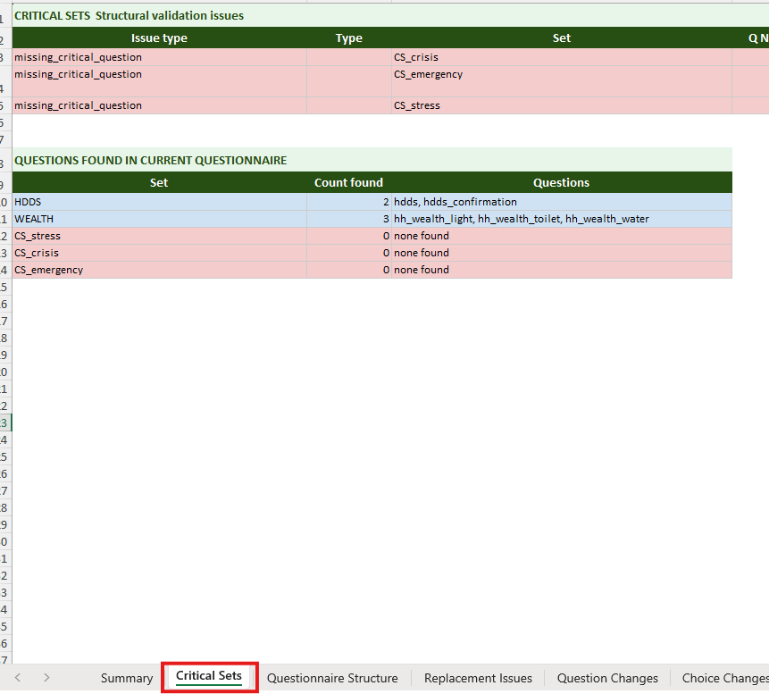

**How to read it:**

- Each row is one missing or misconfigured question, or a failed count check.
- `Field = count` rows indicate a minimum-count threshold failure for a prefix group.
- For `advisory_question` rows (MEDIUM): the question is listed in `critical_sets.yaml` as advisory (`required: false`) — it contributes to indicator coverage but its absence is not a blocker. Review whether the omission is intentional.
- For WEALTH checks: `o_hh_wealth_*` is accepted as an alternative to `hh_wealth_*`.

**Key columns:** Set, Q Name, Field, Reference / rule, Severity.

---

## 3 - Questionnaire Structure Sheet

Three sub-blocks: skip logic references (`relevant`), Q type integrity, and duplicates and KoBo reference syntax.

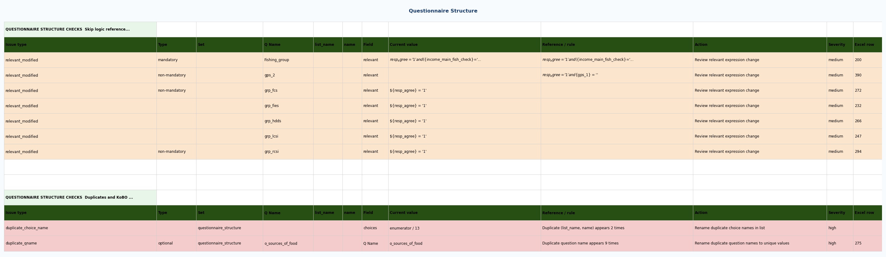

### Skip logic references (relevant)

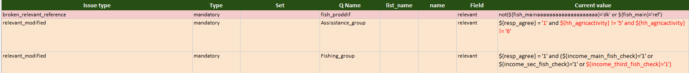

Validates the `relevant` column for broken references, inexact matches, and drift from baseline.

- `broken_relevant_reference` HIGH: a variable referenced in `relevant` does not exist in the form — the routing will fail silently at runtime. Fix before launch.
- `relevant_inexact_reference` HIGH: the exact variable is missing but a close optional counterpart (e.g. `o_var`) exists. Check which variable the expression should target.
- `relevant_modified` MEDIUM: the expression changed from baseline. Review whether the routing still matches the intended logic.

### Q TYPE INTEGRITY ISSUES

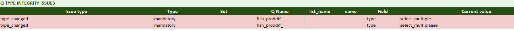

- `type_changed` HIGH: incompatible type transition — restore or confirm with the survey team before launch. MEDIUM: type changed within compatible variants.

### QUESTIONNAIRE STRUCTURE CHECKS - Duplicates and KoBo references

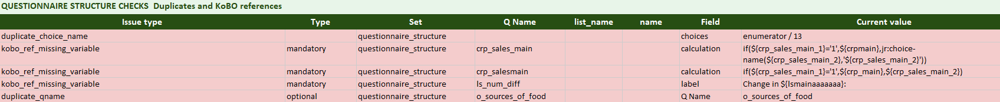

- `duplicate_qname` HIGH: two questions share the same name — rename one before launch.
- `duplicate_choice_name` HIGH: two choices in the same list share the same name — rename one.
- `kobo_ref_loose_syntax` HIGH/MEDIUM: `$var` syntax found — replace with `${var}`.
- `kobo_ref_missing_variable` HIGH: `${var}` references an undefined variable — restore the variable or fix the reference.

**Key columns (all sub-blocks):** Issue type, Q Name, Field, Current value, Reference / rule, Severity, Excel row.

---

## 4 - Replacement Issues Sheet

Checks placeholder consistency between the template, the current questionnaire, and the Additional Information sheet. Unresolved tokens appear as raw `#placeholder#` text on the enumerator's device.

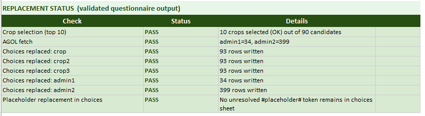

### REPLACEMENT ISSUES - Placeholder and Additional information checks

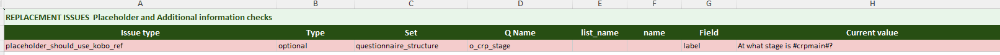

- `placeholder_not_found` HIGH: a token in survey text has no mapping in the Additional Information sheet. Add the missing entry or correct the token spelling.
- `placeholder_should_use_kobo_ref` HIGH: a token matches a survey variable and should be written as `${variable}` instead. Replace the plain text reference.

### ADDITIONAL INFORMATION REPLACEMENT CHANGES (previous_round informational)

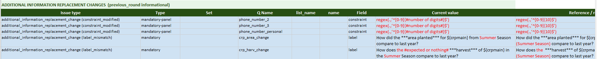

- `additional_information_replacement_change (...)` INFO: difference is replacement-driven — tracked here to avoid confusion in Question and Choice Changes. Review that the replacement content is correct for this round; no action needed otherwise.

**Key columns:** Issue type, Q Name, Field (token name), Current value, Severity.

---

## 5 - Question Changes Sheet

Compares the current XLSForm against the reference question by question — presence, mandatory status, labels, and field-level metadata.

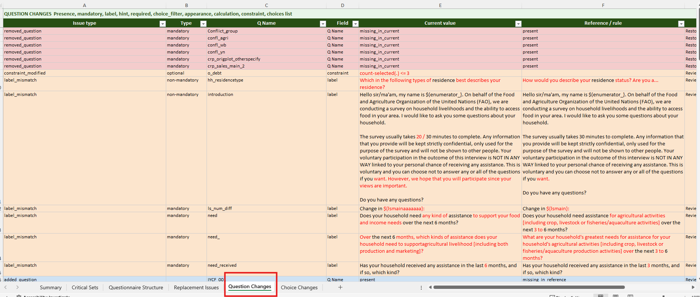

**How to read it:**

- `removed_question` HIGH/INFO: HIGH when the removed question is mandatory; INFO when optional or when the remaining group still meets the minimum count.
- `added_question` INFO: a new question not in the reference — confirm it is intentional.
- `mandatory_to_optional` HIGH: a mandatory question moved to optional counterpart (`o_` prefix). Coverage risk — the question may not be collected for all eligible households.
- `mandatory_column_mismatch` HIGH: the mandatory column value differs from baseline.
- `label_mismatch` MEDIUM: question label text changed. Read both versions and check for meaning drift.
- Field-level changes (`required_modified`, `choice_filter_modified`, `appearance_modified`, `calculation_modified`, `constraint_modified`, `hint_changed`, `choices_list_changed`) are all MEDIUM — review whether the change is intentional and test in KoBo before launch.

**Key columns:** Issue type, Type, Q Name, Field, Current value, Reference / rule, Severity, Excel row.

---

## 6 - Choice Changes Sheet

Compares option additions, removals, label drift, and same-label choice-name renumbering for shared questions.

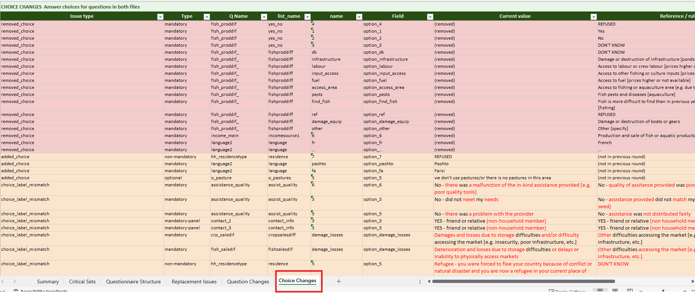

**How to read it:**

- Rows are grouped by Q Name. All choice rows for a question appear together.
- `removed_choice` MEDIUM: a baseline option was removed — respondents can no longer select it. Check historical data coding impact.
- `added_choice` MEDIUM: a new option exists only in the current form — verify coding scheme compatibility.
- `choice_label_mismatch` MEDIUM: option label text changed while the option identity still matches. Check for meaning drift.
- `choice_name_renumbered_same_label` HIGH: choice label stayed equivalent but its `name` value changed (for example `4` to `3`). Treat as coding-change risk.

**Key columns:** Issue type, Q Name, Field (option name), Current value, Reference / rule, Severity.

!!! tip "Cross-referencing Question Changes and Choice Changes"
    If a question shows as `removed_question` in Question Changes, its choices will not appear as standalone `removed_choice` rows in Choice Changes. Always interpret both sheets in combination when assessing the impact of a removed question.

---

## 7 - Validated Questionnaire Output

*Previous-round workflow only.* This is the final ready-to-use XLSForm produced by the validator with all substitutions applied.

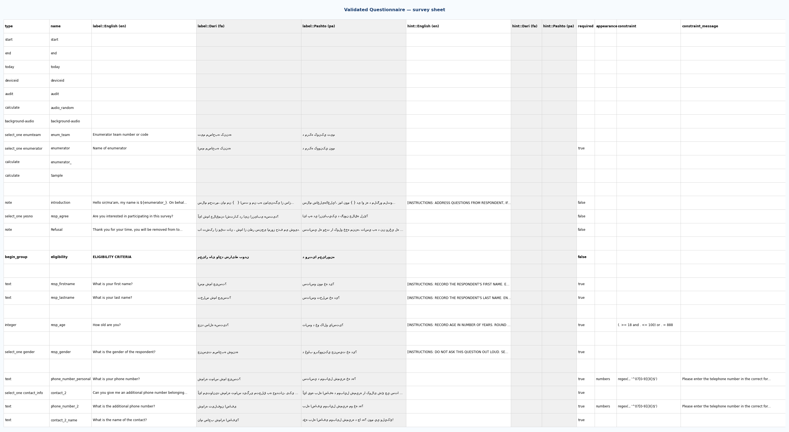

Use it to verify:
- Crop choice lists are rebuilt from the current `Crop list` sheet (no remaining placeholder rows).
- Admin area names are present (fetched from AGOL where available).
- All `#placeholder#` tokens are resolved before deploying to KoBo.
