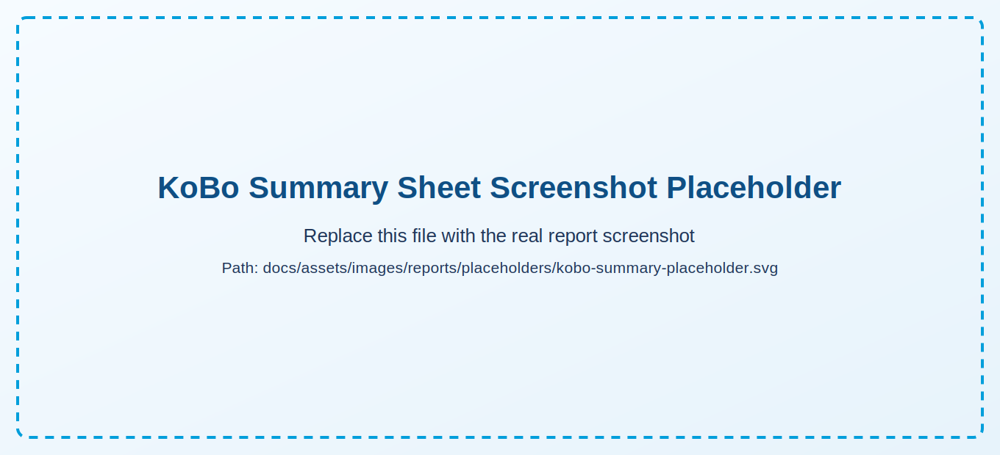
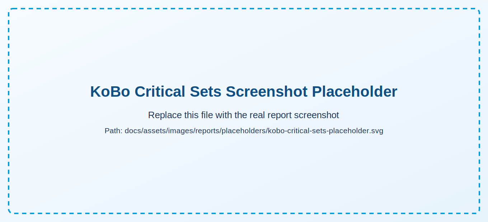
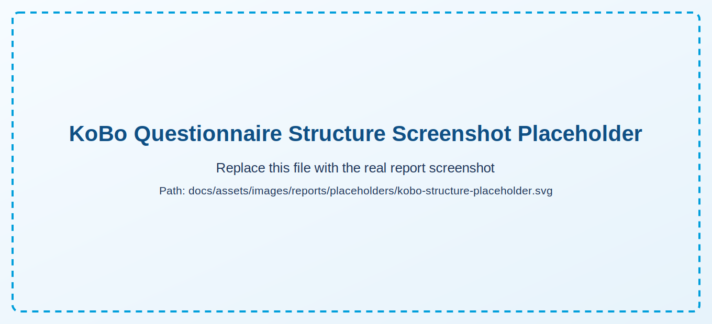
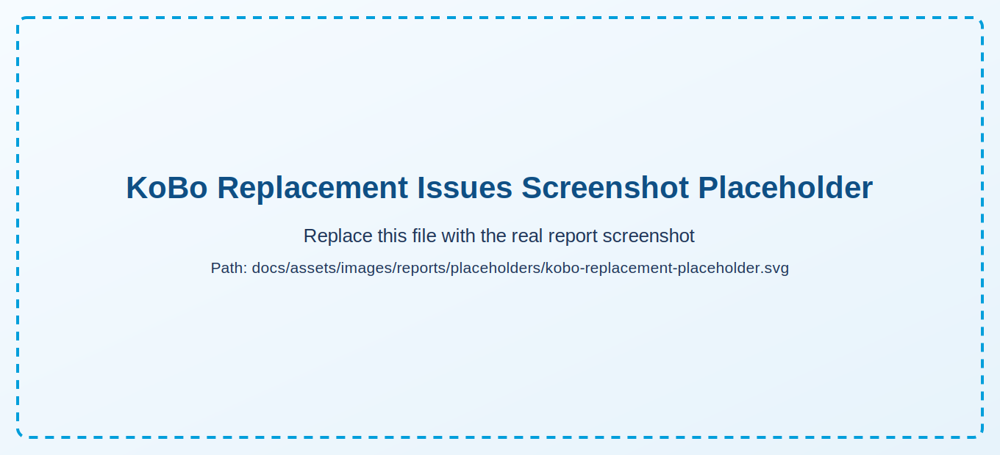
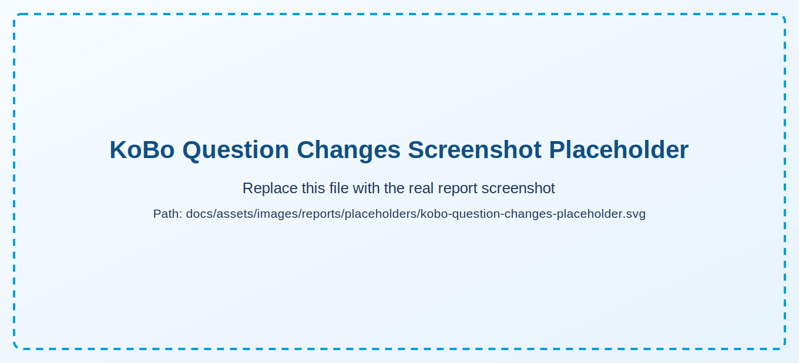
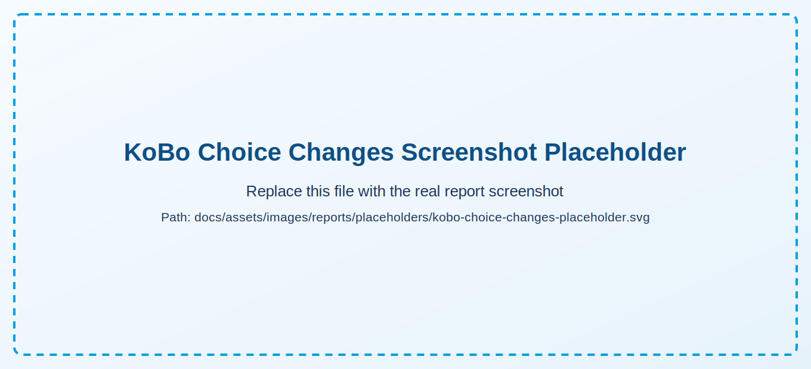
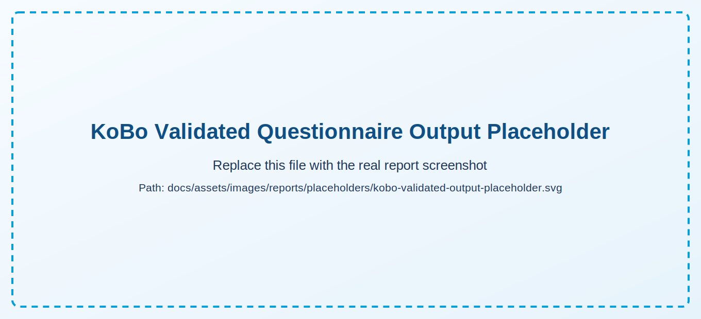

# KoBo Report

This page is a compact visual checklist. For deep interpretation, use [KoBo Logic](../workflow/kobo-logic.md).

## Sheet Sequence

1. Summary
2. Critical Sets
3. Questionnaire Structure
4. Replacement Issues
5. Question Changes
6. Choice Changes
7. Validated Questionnaire Output checks (if previous-round workflow)

## Severity Legend

- Blocking issues: HIGH
- Review-required issues: MEDIUM
- Informational differences: INFO

## Placeholders to Replace

<strong>Add real screenshots in:</strong> <code>docs/assets/images/reports/</code>. Suggested names are shown under each placeholder.

### Summary

{: .sheet-placeholder }

Suggested real file: `docs/assets/images/reports/kobo-summary.png`

Run context shown at the top of Summary:
- `Comparison basis` (latest template or previous round)
- `Current questionnaire` (file being validated)
- `Checked against` (resolved reference file descriptor)
- `Language scope` (configured KoBo label column)
- `Template used for placeholder mapping`

### Critical Sets

{: .sheet-placeholder }

Suggested real file: `docs/assets/images/reports/kobo-critical-sets.png`

### Questionnaire Structure

{: .sheet-placeholder }

Suggested real file: `docs/assets/images/reports/kobo-structure.png`

### Replacement Issues

{: .sheet-placeholder }

Suggested real file: `docs/assets/images/reports/kobo-replacement-issues.png`

Issue note: in `previous_round` mode, replacement-driven deltas appear as
`additional_information_replacement_change (...)` in this sheet.

### Question Changes

{: .sheet-placeholder }

Suggested real file: `docs/assets/images/reports/kobo-question-changes.png`

### Choice Changes

{: .sheet-placeholder }

Suggested real file: `docs/assets/images/reports/kobo-choice-changes.png`

### Validated Questionnaire Output

{: .sheet-placeholder }

Suggested real file: `docs/assets/images/reports/kobo-validated-output.png`
