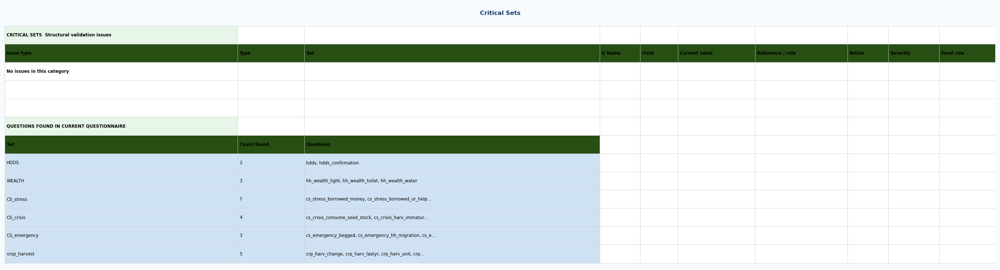
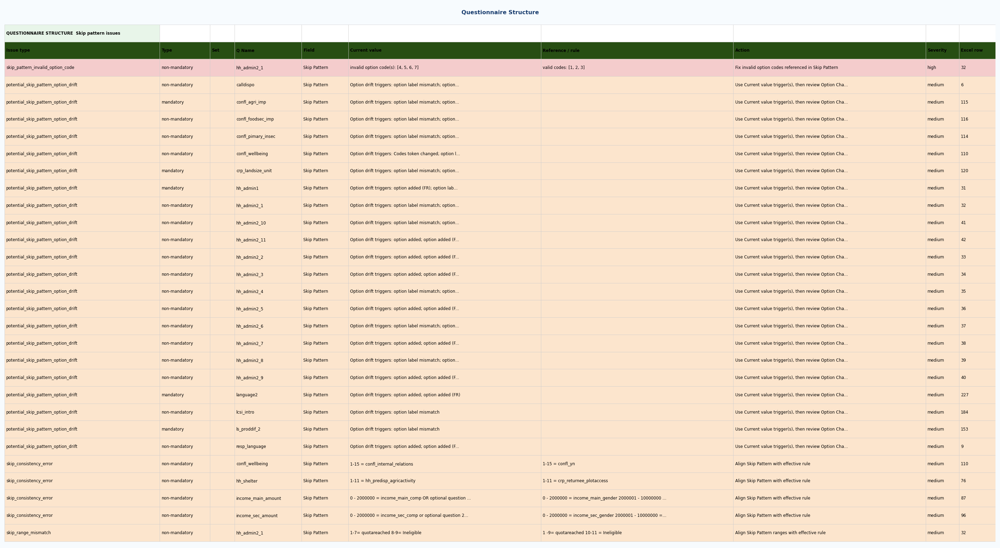
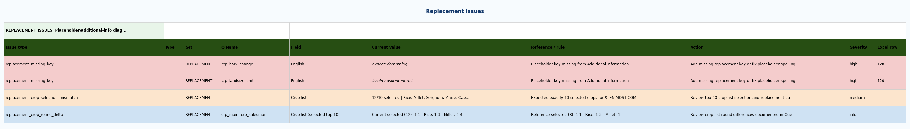
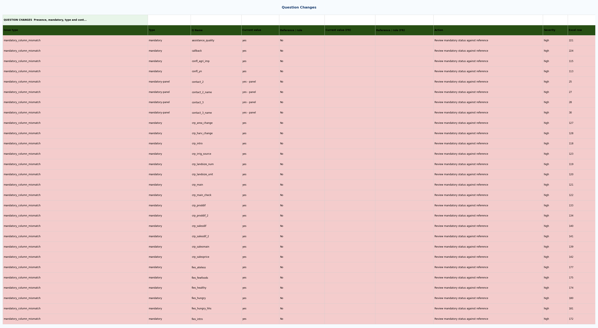
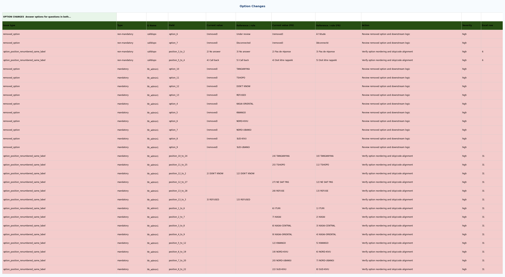

# GeoPoll Validation Logic

**Use this page alongside a real GeoPoll report.** Open the matching Excel sheet for each section.

## Pipeline Context

Before any report row is produced, the validator completes three preparation blocks:

1. **Config and reference resolution**  -  load active config, resolve `latest_template` or `previous_round` baseline.
2. **Extraction and normalization**  -  parse survey rows, options, code tokens; normalize text, skip-logic, and placeholders to reduce false positives.
3. **Issue synthesis**  -  convert raw diffs and rule failures into standardized `issue_type` rows with severity and metadata.

---

## 1  -  Summary Sheet

Aggregates all issue rows by severity and by check group. Read this first  -  it tells you which detail sheets need attention without opening each one.

- If any `HIGH` row is present  -  the questionnaire should not be launched until resolved.
- Use Summary as a triage map, not for root-cause investigation.
- Open the specific detail sheet for every check group that is not PASS.

{: .sheet-placeholder }

---

## 2  -  Critical Sets Sheet

Checks whether all required questions defined in `critical_sets.yaml` are present and have the correct mandatory behavior. A structurally incomplete questionnaire can pass all other checks and still produce broken indicators.

{: .sheet-placeholder }

### Issue types

  

    <code>missing_critical_question</code>
    HIGH
    A required critical question is absent from the current questionnaire. Min-count deficits are also reported under this type (field = <code>count</code>). For WEALTH checks, <code>o_hh_wealth_*</code> is accepted as an alternative to <code>hh_wealth_*</code>.
  

  

    <code>critical_mandatory_mismatch</code>
    HIGH
    The question exists but its Mandatory column value doesn't match the configured expectation.
  

  

    <code>advisory_question</code>
    MEDIUM
    A non-required advisory question (<code>required: false</code>) is absent. Not a blocker.
  

  

    <code>crop_harvest_violation</code>
    HIGH
    The crop/harvest question set is incomplete  -  neither the minimal nor the full allowed composition is present.
  

---

## 3  -  Questionnaire Structure Sheet

Validates skip routing logic, option-code references, and duplicate Q Names.

### Skip pattern column priority

The validator resolves an **effective skip rule** per question using this column priority:

<strong>Priority (highest first):</strong> 
1. <code>Specify skip pattern variable (from blue text)</code>  -  user-authored override, always authoritative when filled 
2. <code>Skip Pattern</code>  -  the standard routing field 
3. <code>Default skip patterns &amp; conditional</code>  -  fallback rule used when the above two are empty  
Both the current questionnaire and the reference use the same priority to determine their respective effective rules before comparing them.

{: .sheet-placeholder }

### Skip Pattern Issues

  

    <code>skip_pattern_empty</code>
    HIGH
    The Default column has a routing rule but both Specify and Skip Pattern are empty  -  the skip routing is not filled in.
  

  

    <code>default_skip_modified</code>
    INFO
    Specify is blank and both Skip Pattern and Default are filled, but they disagree  -  internal inconsistency within the current questionnaire, not a reference comparison.
  

  

    <code>skipPattern_invalid_qname</code>
    HIGH
    The effective skip rule routes to a Q Name that doesn't exist in the current questionnaire.
  

  

    <code>skipPattern_invalid_qnameCategory</code>
    HIGH
    The reference uses a flexible rule ("route to an optional question or non-mandatory alternative") but the Skip Pattern routes to a <strong>mandatory</strong> question.
  

  

    <code>skipPattern_changes</code>
    INFO
    The effective skip rule differs from the reference  -  the routing target or condition changed.
  

  

    <code>skipPattern_range_mismatch</code>
    INFO
    The option code numbers in the Skip Pattern for a given target differ from what the reference specifies.
  

  

    <code>skipPattern_range_invalid</code>
    HIGH
    The effective skip rule references option codes that don't exist in the current answer options for that question.
  

### Q Type Integrity Issues

  
<code>qtype_changed</code>  -  severity is dynamic

  

    HIGH
    Incompatible or structurally invalid type transition (e.g. single-select to multi-select, numeric to open-text). Applies regardless of mandatory status.
  

  

    MEDIUM
    Type changed within compatible variants (e.g. label-only type reclassification).
  

### Duplicate Q Name Issues

  

    <code>duplicate_qname</code>
    HIGH
    Duplicate Q Name values cause reference collisions in skip logic and data joins.
  

---

## 4  -  Replacement Issues Sheet

Validates placeholder token coverage. Unresolved placeholders appear as literal `$...$` tokens to the enumerator and invalidate downstream label interpretation.

{: .sheet-placeholder }

### Issue types

  

    <code>replacement_additional_info_missing</code>
    HIGH
    The Additional Information sheet failed to load replacement keys  -  no placeholder substitution is possible.
  

  

    <code>replacement_crop_selection_mismatch</code>
    MEDIUM
    Crop list selection doesn't match the expected shape (e.g. top-10 rule not met).
  

  

    <code>replacement_crop_round_delta</code>
    INFO
    The selected crop set differs from the reference round. Track for longitudinal comparability.
  

  

    <code>replacement_missing_key</code>
    HIGH
    A placeholder token exists in the questionnaire text but no replacement key was found in Additional Information.
  

  
<code>replacement_unresolved_placeholder</code>  -  severity is dynamic

  

    HIGH
    A <strong>crop placeholder</strong> remains unresolved in the validated text. Crop tokens are structural.
  

  

    MEDIUM
    A <strong>non-crop placeholder</strong> had a mapping but still appears unresolved in the output text.
  

  

    <code>replacement_malformed_placeholder</code>
    MEDIUM
    Placeholder token format is malformed  -  unbalanced markers that cannot be processed.
  

---

## 5  -  Question Changes Sheet

Compares the current questionnaire against the reference question by question. This is the primary comparability risk layer  -  even small wording changes can alter indicator interpretation.

{: .sheet-placeholder }

### Question Changes (Core)

*Report block: "QUESTION CHANGES (CORE)  -  Presence, mandatory, Q type, labels"*

  

    <code>mandatory_source_missing</code>
    HIGH
    The Mandatory column is largely blank in one of the files  -  mandatory-based comparisons cannot be trusted. Verify the source column is populated before reviewing other issues.
  

  
<code>removed_question</code>  -  severity is dynamic

  

    HIGH
    Removed question is <code>mandatory</code> or <code>mandatory-panel</code> in the reference.
  

  

    INFO
    Removed question is optional, or the group's min-count threshold is still met after removal (prefix-count downgrade).
  

  

    <code>added_question</code>
    INFO
    New question not in the reference. Track for traceability.
  

  

    <code>mandatory_to_optional</code>
    HIGH
    A mandatory baseline question now appears only as optional  -  the question may not be collected for all households.
  

  

    <code>mandatory_column_mismatch</code>
    HIGH
    The Mandatory column value differs from the reference.
  

  

    <code>question_label_mismatch</code>
    MEDIUM
    Question wording changed after normalization. Verify interpretive equivalence.
  

  
<code>qtype_changed</code>  -  severity is dynamic

  

    HIGH
    Incompatible or invalid type transition (e.g. single-select to multi-select, numeric to open-text). Applies regardless of mandatory status.
  

  

    MEDIUM
    Type changed within compatible variants (e.g. label-only type reclassification).
  

### Question Changes (Operational Fields)

*Report block: "QUESTION CHANGES (OPERATIONAL FIELDS)"*

  

    <code>randomize_changed</code>
    INFO
    The Randomize column changed. Review for execution impact on option ordering.
  

  

    <code>conditional_changed</code>
    INFO
    The Conditional column changed. Track for traceability.
  

  

    <code>programming_instructions_changed</code>
    INFO
    The Programming Instructions column changed.
  

  

    <code>core_questions_only_changed</code>
    INFO
    The Core questions only flag changed, which may alter inclusion logic for core indicator calculations.
  

---

## 6  -  Option Changes Sheet

Compares answer sets at the option level. Answer-set drift changes respondent meaning even when the question stem is unchanged.

!!! warning "Read Question Changes and Option Changes together"
    If a question is removed, its options typically won't appear as standalone option removals.

{: .sheet-placeholder }

### Issue types

  

    <code>removed_option</code>
    MEDIUM
    A baseline option no longer exists in the current questionnaire.
  

  

    <code>added_option</code>
    MEDIUM
    A new option exists only in the current questionnaire.
  

  

    <code>option_label_mismatch</code>
    MEDIUM
    Option text changed while the option identity (position or code) still matched.
  

  

    <code>option_position_renumbered_same_label</code>
    INFO
    Option ordering changed with no label-text change. Labels are stable.
  

  

    <code>codes_col_removed</code>
    HIGH
    Code values removed from the Codes column  -  breaks downstream data mappings.
  

  

    <code>codes_col_added</code>
    MEDIUM
    New code values added. Verify skip-logic and data-coding compatibility.
  

  

    <code>codes_col_token_mismatch</code>
    MEDIUM
    Code tokens differ for the same matched option  -  the option now maps to a different code.
  

  

    <code>codes_col_renumbered_same_token</code>
    INFO
    Numeric code positions changed while token semantics stayed stable.
  

---

## Recommended Review Sequence

1. **Summary**  -  triage and identify blocked check groups
2. **Critical Sets**  -  confirm structural completeness
3. **Questionnaire Structure**  -  validate skip routing and naming
4. **Replacement Issues**  -  confirm all placeholders resolved
5. **Question Changes**  -  assess comparability
6. **Option Changes**  -  verify answer-set stability

