# GeoPoll Validation Logic

**Use this page alongside a real GeoPoll report.** Open the matching Excel sheet for each section.

## Pipeline Context

Before any report row is produced, the validator completes three preparation blocks:

1. **Config and reference resolution** - load active config, resolve `latest_template` or `previous_round` baseline.
2. **Extraction and normalization** - parse survey rows, options, code tokens; normalize text, skip-logic, and placeholders to reduce false positives.
3. **Issue synthesis** - convert raw diffs and rule failures into standardized `issue_type` rows with severity and metadata.

---

## 1 - Summary Sheet

Aggregates all issue rows by severity and by check group. Read this first - it tells you which detail sheets need attention without opening each one.

- If any `HIGH` row is present - the questionnaire should not be launched until resolved.
- Use Summary as a triage map, not for root-cause investigation.
- Open the specific detail sheet for every check group that is not PASS.

The run context block at the top of the sheet records which questionnaire and reference were used, so the report is self-contained for review and audit.

<strong>Screenshot to add:</strong> <code>docs/assets/images/reports/geopoll-sum-config-header.png</code> — the run context rows at the top of the Summary sheet

{: .sheet-placeholder }

---

## 2 - Critical Sets Sheet

Checks whether all required questions defined in `critical_sets.yaml` are present and have the correct mandatory behavior. A structurally incomplete questionnaire can pass all other checks and still produce broken indicators.

### How rules are defined

`critical_sets.yaml` defines three distinct rule types. `exact_sets` lists named questions individually — each can be marked required (`required: true`) or advisory (`required: false`). A required question that is absent or incorrectly flagged as mandatory triggers a HIGH; an advisory one triggers MEDIUM. `min_count_sets` works on prefixes rather than individual names: it requires a minimum number of questions matching a given prefix to be present, and reports against the `count` field when the threshold is not met. `crop_harvest` checks form composition — the questionnaire must contain either the minimal or the full crop/harvest question set; partial inclusion is a structural violation.

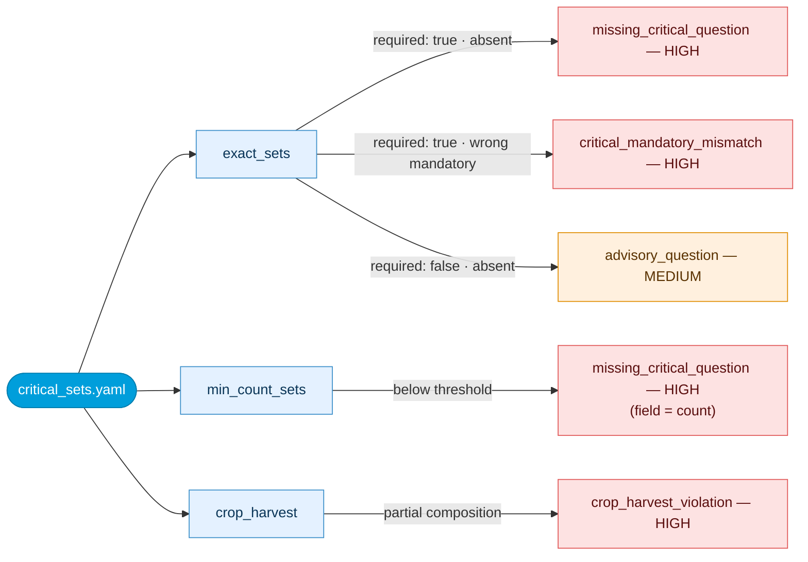

**min_count_sets thresholds:** `hh_wealth_*` (or `o_hh_wealth_*`) ≥ 1 · `cs_stress_*` ≥ 4 · `cs_crisis_*` ≥ 3 · `cs_emergency_*` ≥ 3

**crop_harvest sets:** Minimal = `crp_harv_change` only · Full = `crp_harv_change` + `crp_harv_vol` + `crp_harv_unit` + `crp_harv_unit_kg` + `crp_harv_lastyr`

### Issue types

  

    <code>missing_critical_question</code>
    HIGH
    A required critical question is absent from the current questionnaire. Min-count deficits are also reported under this type (field = <code>count</code>). For WEALTH checks, <code>o_hh_wealth_*</code> is accepted as an alternative to <code>hh_wealth_*</code>.
  

  

    What to do
    Add the missing question back to the questionnaire. The Q Name and expected mandatory value are shown in the Reference column. For count failures, the Reference column shows the minimum required number of questions for that prefix group.
  

  

    <code>critical_mandatory_mismatch</code>
    HIGH
    The question exists but its Mandatory column value doesn't match the configured expectation.
  

  

    What to do
    Update the Mandatory column for this question to the value shown in the Reference column.
  

  

    <code>advisory_question</code>
    MEDIUM
    A question listed in <code>critical_sets.yaml</code> with <code>required: false</code> is absent. These questions are not mandatory for the round to proceed, but they are tracked because they contribute to indicator coverage or data quality. The validator flags them so the omission is a conscious decision, not an oversight.
  

  

    What to do
    Check whether omitting this question affects indicator coverage or comparability for this round. If the omission is intentional, note it in the round documentation and move on — no fix required to proceed.
  

  

    <code>crop_harvest_violation</code>
    HIGH
    The crop/harvest question set is incomplete - neither the minimal nor the full allowed composition is present.
  

  

    What to do
    Ensure the crop/harvest question block is complete. Either the minimal required set or the full allowed set must be present — a partial block is not accepted.
  

---

## 3 - Questionnaire Structure Sheet

Validates skip routing logic, option-code references, and duplicate Q Names.

### How checks are structured

The sheet organizes its output into three independent check blocks. Skip routing is checked first because broken references can cascade silently across multiple questions in the field. Q type and duplicate checks are independent of routing and run in parallel.

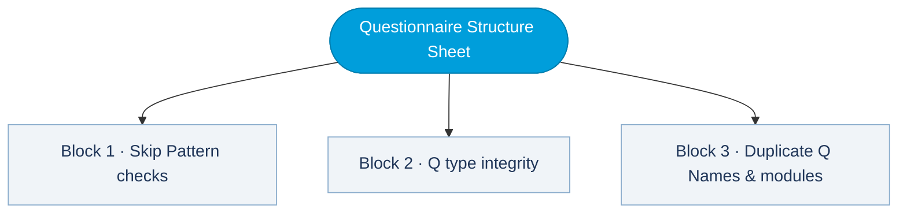

### Block 1 · Skip Pattern checks

GeoPoll uses a three-column priority system to determine the effective skip rule per question: `Specify skip pattern variable` overrides everything when filled, then `Skip Pattern`, then `Default skip patterns & conditional` as a fallback. The validator resolves this priority for both the current and reference questionnaire before comparing. Issues arise when the resolved rule targets a Q Name that doesn't exist, uses an incorrect category, or has drifted from the baseline without an obvious reason.

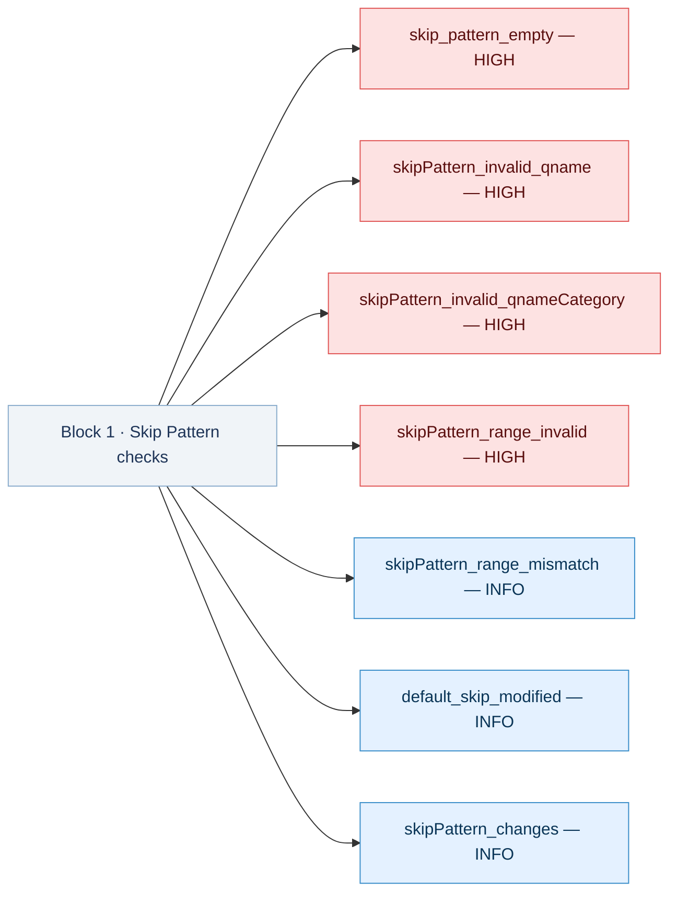

#### Skip pattern column priority

The validator resolves an **effective skip rule** per question using this column priority:

<strong>Priority (highest first):</strong> 
1. <code>Specify skip pattern variable (from blue text)</code> - user-authored override, always authoritative when filled 
2. <code>Skip Pattern</code> - the standard routing field 
3. <code>Default skip patterns &amp; conditional</code> - fallback rule used when the above two are empty  
Both the current questionnaire and the reference use the same priority to determine their respective effective rules before comparing them.

### Skip Pattern Issues

  

    <code>skip_pattern_empty</code>
    HIGH
    The Default column has a routing rule but both Specify and Skip Pattern are empty - the skip routing is not filled in.
  

  

    What to do
    Fill in the Skip Pattern column for this question. The Default column shows the intended routing rule — use it as the starting point and confirm it matches the questionnaire design.
  

  

    <code>default_skip_modified</code>
    INFO
    Specify is blank and both Skip Pattern and Default are filled, but they disagree - internal inconsistency within the current questionnaire, not a reference comparison.
  

  

    What to do
    Align the Skip Pattern with the Default column rule, or fill in the Specify column to explicitly override both. The two columns should not contradict each other.
  

  

    <code>skipPattern_invalid_qname</code>
    HIGH
    The effective skip rule routes to a Q Name that doesn't exist in the current questionnaire.
  

  

    What to do
    Check the Skip Pattern for this question. The target Q Name in the routing instruction doesn't exist — look for a typo, or check if the question was renamed or removed. The Excel row column helps you find the exact cell.
  

  

    <code>skipPattern_invalid_qnameCategory</code>
    HIGH
    The reference uses a flexible rule ("route to an optional question or non-mandatory alternative") but the Skip Pattern routes to a <strong>mandatory</strong> question.
  

  

    What to do
    Change the routing target to the optional counterpart of the question (e.g. if routing to <code>hh_size</code>, route to <code>o_hh_size</code> instead). Flexible rules must point to an optional question.
  

  

    <code>skipPattern_changes</code>
    INFO
    The effective skip rule differs from the reference - the routing target or condition changed.
  

  

    What to do
    Compare the Current value and Reference columns to see what changed. Confirm the new routing is intentional and still leads to the correct question. No fix needed if the change is deliberate.
  

  

    <code>skipPattern_range_mismatch</code>
    INFO
    The option code numbers in the Skip Pattern for a given target differ from what the reference specifies.
  

  

    What to do
    Check whether the answer options for this question were renumbered. If so, update the code range in the Skip Pattern to match the current option numbers.
  

  

    <code>skipPattern_range_invalid</code>
    HIGH
    The effective skip rule references option codes that don't exist in the current answer options for that question.
  

  

    What to do
    Open the Options section for this question and compare the actual option codes against what the Skip Pattern references. Update the code range in the Skip Pattern to match what is actually there.
  

### Block 2 · Q type integrity

Question types are normalized before comparison to absorb cosmetic differences between rounds. The validator then classifies each transition: a change within compatible variants (e.g. minor formatting differences) is MEDIUM; an incompatible transition that alters how the platform collects or stores the answer (e.g. single-select to open text) is HIGH and must be resolved before launch.

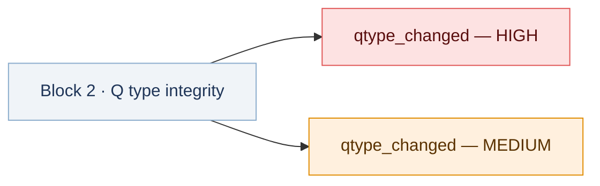

#### Issue types

  
<code>qtype_changed</code> - severity is dynamic

  

    HIGH
    Incompatible or structurally invalid type transition (e.g. single-select to multi-select, numeric to open-text). Also includes missing current type when reference has a type, or unknown/unlisted type tokens. Applies regardless of mandatory status.
  

  

    MEDIUM
    Type changed within compatible variants (e.g. label-only type reclassification).
  

  

    What to do
    Check the Q Type column for this question. The Current value and Reference columns show the before/after types. If HIGH, the change is structurally incompatible — verify that skip logic, data coding, and any downstream calculations still work correctly. If MEDIUM, confirm the reclassification was intentional.
  

### Block 3 · Duplicate Q Names & modules

Two independent checks run here. The first flags duplicate Q Names — all Q Names must be unique across the questionnaire because they serve as identifiers in skip routing and data joins. The second checks module-level structure against the template: every module present in the template must appear in the current form, and any module present in the current form but absent from the reference is flagged for traceability.

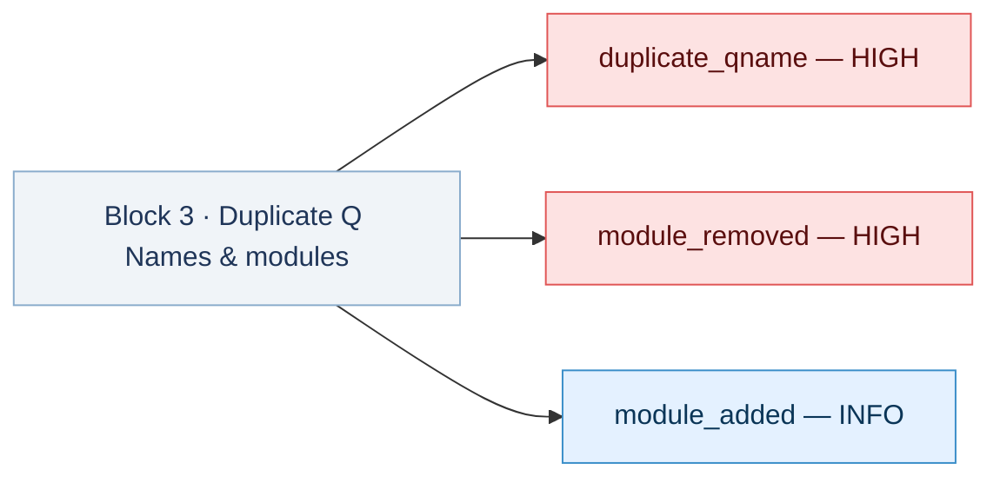

#### Issue types

  

    <code>duplicate_qname</code>
    HIGH
    Duplicate Q Name values cause reference collisions in skip logic and data joins.
  

  

    What to do
    Rename one of the duplicated questions so all Q Names are unique. The Excel row column shows where each duplicate is located in the source file.
  

  

    <code>module_removed</code>
    HIGH
    A question module required by the template is absent from the current questionnaire. The module name in the Field column identifies which thematic block is missing.
  

  

    What to do
    Restore the missing module before launch, or get explicit approval for its removal. A missing module means an entire thematic block of questions will not be collected in this round.
  

  

    <code>module_added</code>
    INFO
    A module exists in the current questionnaire but was absent from the selected reference. Track for traceability.
  

  

    What to do
    Confirm the addition is intentional. If so, no action needed — document the new module in the round notes.
  

---

## 4 - Replacement Issues Sheet

Validates placeholder token coverage. Unresolved placeholders appear as literal `$...$` tokens to the enumerator and invalidate downstream label interpretation.

### How checks are structured

The replacement check runs in two stages. First it loads replacement keys from the Additional Information sheet — if this step fails, `replacement_additional_info_missing` is the root cause and all other replacement issues in this run may be side effects of it. Second, every `$token$` placeholder in the questionnaire text is matched against the loaded keys. Crop placeholder resolution is treated as structurally critical (HIGH) because crop rows are generated from the crop list and a failed substitution affects multiple questions simultaneously. Non-crop tokens that survive to the output file are MEDIUM.

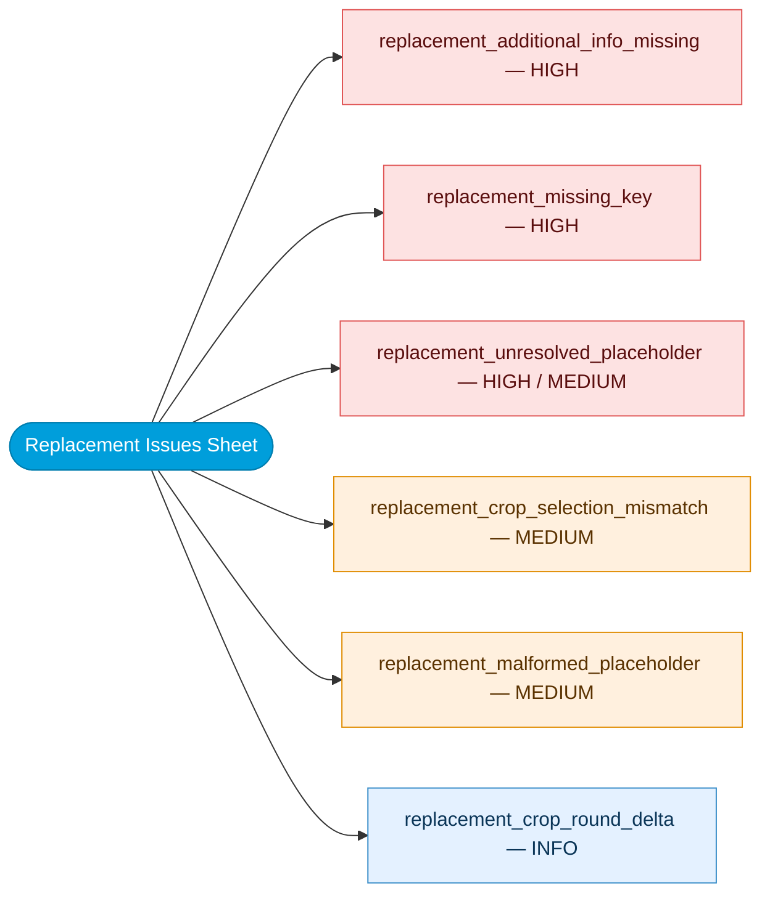

### Issue types

  

    <code>replacement_additional_info_missing</code>
    HIGH
    The Additional Information sheet failed to load replacement keys - no placeholder substitution is possible.
  

  

    What to do
    Check that the Additional Information sheet exists in the questionnaire file, is correctly named, and the file is not open/locked in Excel. Fix this first — all other replacement issues may be side effects of this root cause.
  

  

    <code>replacement_crop_selection_mismatch</code>
    MEDIUM
    Crop list selection doesn't match the expected shape (e.g. top-10 rule not met).
  

  

    What to do
    Review the Crop list sheet. Check that exactly the required number of crops are selected and the selection flags are set correctly.
  

  

    <code>replacement_crop_round_delta</code>
    INFO
    The selected crop set differs from the reference round. Track for longitudinal comparability.
  

  

    What to do
    Confirm the crop change is intentional. If yes, no action needed — this row is for traceability only. If unexpected, review the Crop list sheet and correct the selection.
  

  

    <code>replacement_missing_key</code>
    HIGH
    A placeholder token exists in the questionnaire text but no replacement key was found in Additional Information.
  

  

    What to do
    The Field column shows the unresolved token name. Either add a matching key/value row in the Additional Information sheet, or fix the spelling of the token in the questionnaire text so it matches an existing key.
  

  
<code>replacement_unresolved_placeholder</code> - severity is dynamic

  

    HIGH
    A <strong>crop placeholder</strong> remains unresolved in the validated text. Crop tokens are structural.
  

  

    MEDIUM
    A <strong>non-crop placeholder</strong> had a mapping but still appears unresolved in the output text.
  

  

    What to do
    Find the token shown in the Field column in the Additional Information sheet and make sure its value cell is filled in and not blank. For crop tokens (HIGH), also check that the Crop list sheet is complete and the crop names are populated correctly.
  

  

    <code>replacement_malformed_placeholder</code>
    MEDIUM
    Placeholder token format is malformed - unbalanced markers that cannot be processed.
  

  

    What to do
    Fix the placeholder syntax in the questionnaire text. The correct format is <code>$key$</code> — both dollar signs must be present with no extra spaces or characters inside.
  

---

## 5 - Question Changes Sheet

Compares the current questionnaire against the reference question by question. This is the primary comparability risk layer - even small wording changes can alter indicator interpretation.

### Question Changes (Core)

*Report block: "QUESTION CHANGES (CORE) — Presence, mandatory, Q type, labels"*

Presence and mandatory status comparisons run across all questions in the reference. A missing mandatory question is flagged HIGH immediately, before any field-level checks. `mandatory_source_missing` is a data quality gate — if the Mandatory column is largely blank in either file, all mandatory-based results below it should be treated with caution. Label comparisons use inline word-diff highlighting in the report: changed words appear underlined or colored in the Current value and Reference columns.

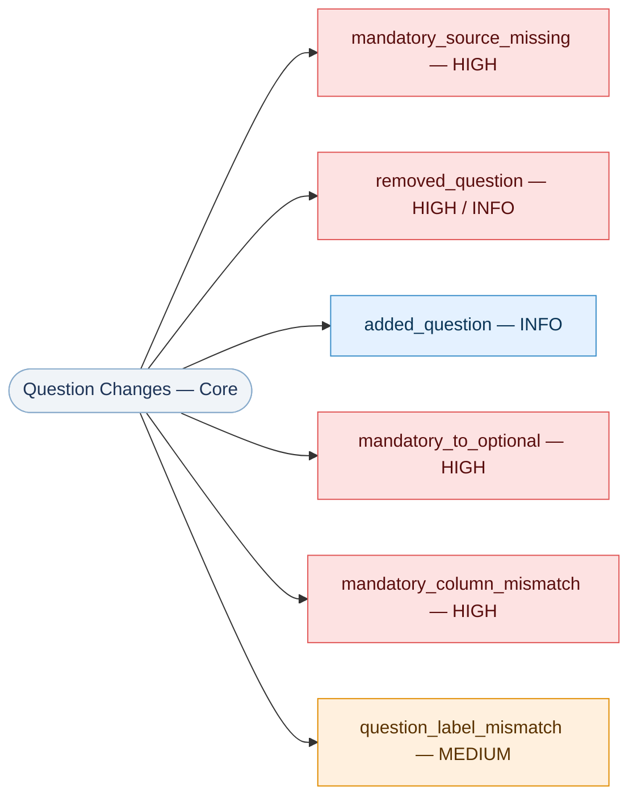

  

    <code>mandatory_source_missing</code>
    HIGH
    The Mandatory column is largely blank in one of the files - mandatory-based comparisons cannot be trusted. Verify the source column is populated before reviewing other issues.
  

  

    What to do
    Check that the Mandatory column exists and is filled in the flagged file. Fix this before acting on any other mandatory-related issues in this report — all mandatory comparisons below this row may be unreliable.
  

  
<code>removed_question</code> - severity is dynamic

  

    HIGH
    Removed question is <code>mandatory</code> or <code>mandatory-panel</code> in the reference.
  

  

    INFO
    Removed question is optional, or the group's min-count threshold is still met after removal (prefix-count downgrade).
  

  

    What to do
    Restore the question or document that the removal is approved. For HIGH rows, the question is mandatory and its absence will affect data collection for this round. The Reference column shows the original question label for context.
  

  

    <code>added_question</code>
    INFO
    New question not in the reference. Track for traceability.
  

  

    What to do
    Confirm the addition is intentional. No action needed if it is planned. If unexpected, check whether it was copied from another section of the questionnaire by mistake.
  

  

    <code>mandatory_to_optional</code>
    HIGH
    A mandatory baseline question now appears only as optional - the question may not be collected for all households.
  

  

    What to do
    Update the Mandatory column to restore mandatory status, or document clearly why it was intentionally changed to optional for this round.
  

  

    <code>mandatory_column_mismatch</code>
    HIGH
    The Mandatory column value differs from the reference.
  

  

    What to do
    Correct the Mandatory column value to match what is shown in the Reference column, or document the reason for the deliberate change.
  

  

    <code>question_label_mismatch</code>
    MEDIUM
    Question wording changed after normalization. Verify interpretive equivalence.
  

  

    What to do
    Read the word-diff in the Current value and Reference columns — changed words are highlighted. If the meaning is equivalent (e.g. a minor phrasing refinement), no action needed. If the meaning changed in a way that affects what the respondent is answering, assess comparability with previous rounds.
  

### Question Changes (Operational Fields)

*Report block: "QUESTION CHANGES (OPERATIONAL FIELDS)"*

Operational field changes are tracked for traceability only — all rows in this block are INFO. These columns (Randomize, Conditional, Programming Instructions, Core questions only) control execution behavior rather than question content, so drift here does not affect data comparability but may affect how the survey runs or how indicator outputs are scoped.

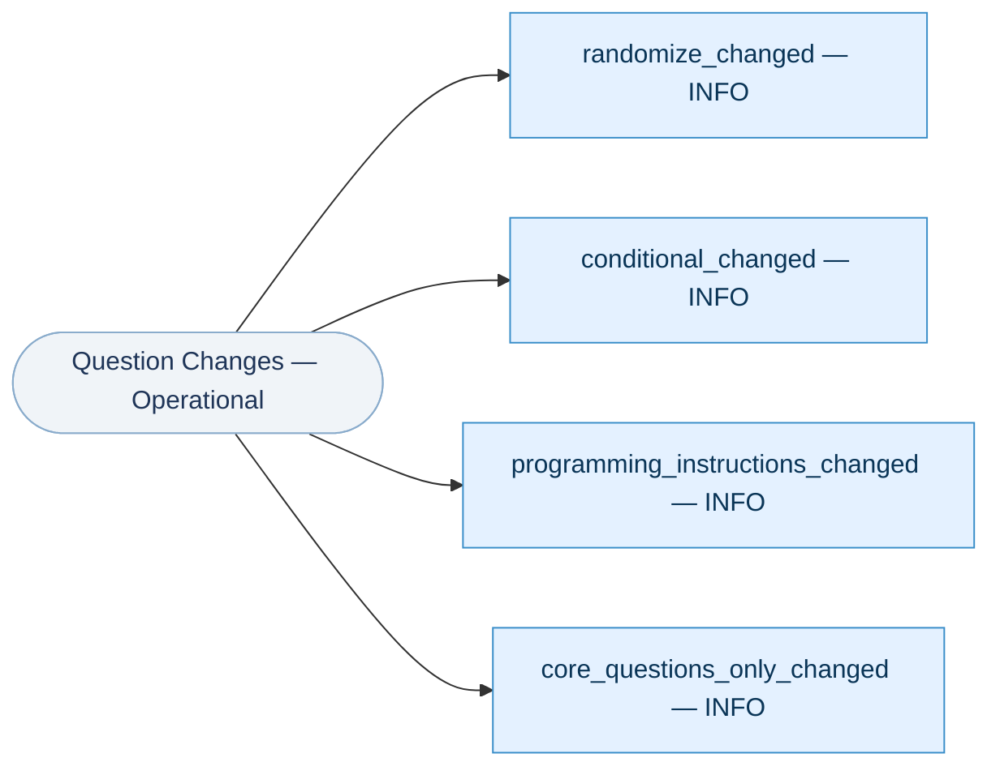

  

    <code>randomize_changed</code>
    INFO
    The Randomize column changed. Review for execution impact on option ordering.
  

  

    What to do
    Check whether option order randomization should still apply for this question. Update the Randomize column if the change was unintentional.
  

  

    <code>conditional_changed</code>
    INFO
    The Conditional column changed. Track for traceability.
  

  

    What to do
    Compare the Current value and Reference columns to see what changed in the conditional routing text. Confirm the new logic is correct and intentional.
  

  

    <code>programming_instructions_changed</code>
    INFO
    The Programming Instructions column changed.
  

  

    What to do
    Review what changed in the instructions. Confirm the change doesn't affect how the question is programmed or displayed to the enumerator.
  

  

    <code>core_questions_only_changed</code>
    INFO
    The Core questions only flag changed, which may alter inclusion logic for core indicator calculations.
  

  

    What to do
    Check whether this question should be included in core indicator outputs. Update the flag to match the intended scope for this round.
  

---

## 6 - Option Changes Sheet

Compares answer sets at the option level. Answer-set drift changes respondent meaning even when the question stem is unchanged.

!!! warning "Read Question Changes and Option Changes together"
    If a question is removed, its options typically won't appear as standalone option removals.

### How checks are structured

For each shared question, the validator compares option lists using both position number and label text. When a Codes column is present, code values are compared in parallel and get their own issue types. Removed options carry the highest data risk — respondents can no longer select a previously available answer, and any skip patterns that referenced the removed code need to be updated. When a removal also shifts the position numbers of remaining options, the individual rows are collapsed into a single `removed_option_cascading_drift` row that describes both the removal and its renumbering side effects. When the same question has both additions and removals, those are collapsed into an `option_changes (added/removed)` row. Label changes are tracked independently of identity: an option can keep the same position while its displayed text changes.

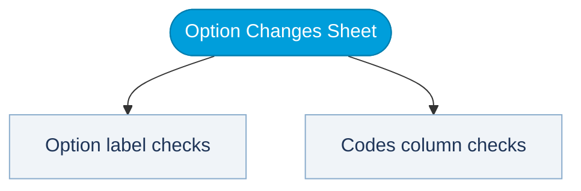

### Option label checks

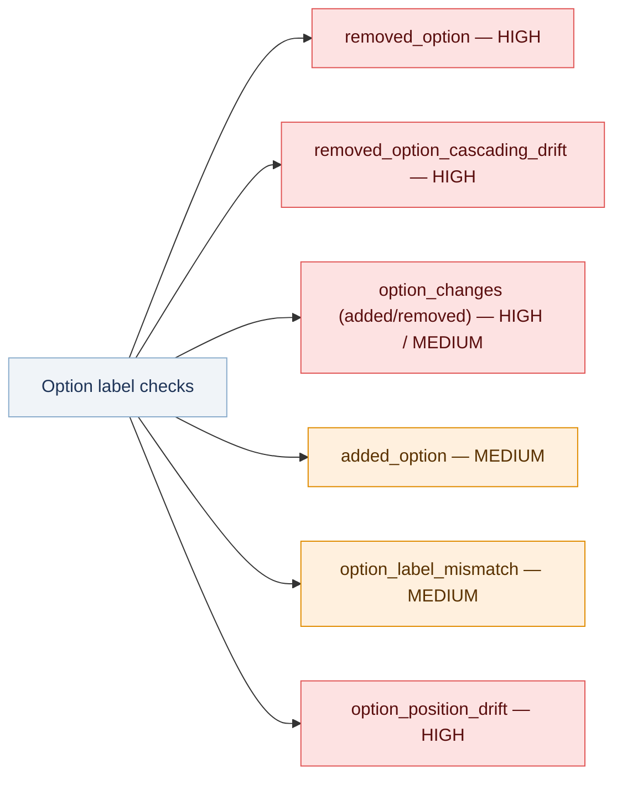

#### Issue types

  

    <code>removed_option</code>
    HIGH
    A baseline option no longer exists in the current questionnaire.
  

  

    What to do
    Add the option back or confirm the removal is intentional. Also check whether any skip patterns reference the removed option's code — if so, those patterns need to be updated too.
  

  

    <code>removed_option_cascading_drift</code>
    HIGH
    One or more options were removed and that removal shifted the position numbers of the remaining options. The row is a consolidated summary — it shows which positions were removed and how surviving options renumbered. Individual <code>removed_option</code> and <code>option_position_drift</code> rows are suppressed when this row is present.
  

  

    What to do
    Confirm the removal is intentional, then check all skip patterns for this question — the codes they reference have shifted. Update skip patterns to use the new position numbers after the removal.
  

  
<code>option_changes (added/removed)</code>  -  severity is dynamic

  

    HIGH
    A question has both options added and options removed. The row consolidates counts for both sides. Severity is HIGH when any underlying removal was HIGH.
  

  

    What to do
    Read the Field column for added and removed counts. Removed options are the priority risk — check skip patterns and data coding for the removed codes. Added options need review for new code alignment.
  

  

    <code>added_option</code>
    MEDIUM
    A new option exists only in the current questionnaire.
  

  

    What to do
    Confirm the new option is intentional. Verify that skip logic and data processing scripts account for the new option code.
  

  

    <code>option_label_mismatch</code>
    MEDIUM
    Option text changed while the option identity (position or code) still matched.
  

  

    What to do
    Read the word-diff in the Current value and Reference columns. If the meaning is equivalent, no action needed. If the wording change alters what the respondent is choosing, assess the comparability impact with previous rounds.
  

  

    <code>option_position_drift</code>
    HIGH
    Option ordering changed — the label is the same but the position number changed. Skip patterns referencing this option's code number are now misaligned.
  

  

    What to do
    Labels are the same — this is a reordering only. Verify that any skip patterns referencing this option's code still use the correct updated code number after the reordering.
  

### Codes column checks

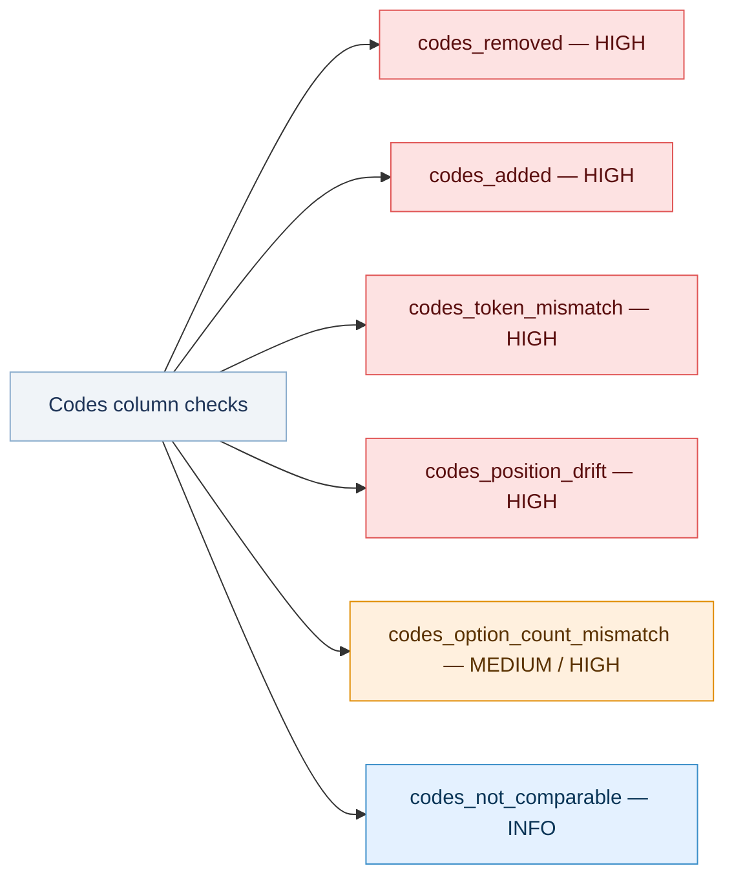

#### Issue types

  

    <code>codes_removed</code>
    HIGH
    Code values removed from the Codes column — breaks downstream data mappings and skip routing that referenced the removed codes.
  

  

    What to do
    Restore the removed code or update all skip patterns and data processing scripts that referenced it. A missing code can break routing silently.
  

  

    <code>codes_added</code>
    HIGH
    New code values added to the Codes column. Severity is HIGH for mandatory and mandatory-panel questions; lower for optional questions. Verify skip-logic and data-coding compatibility.
  

  

    What to do
    Confirm the new code is intentional. Check that skip logic and data processing scripts account for it, especially if the question is mandatory.
  

  

    <code>codes_token_mismatch</code>
    HIGH
    Code tokens differ for the same matched option — the option now maps to a different code value.
  

  

    What to do
    The code token changed for this option. Update any skip patterns or processing scripts that reference this code to use the new value.
  

  

    <code>codes_position_drift</code>
    HIGH
    Numeric code positions changed while token semantics stayed stable. Skip patterns that use the old code number to route conditional logic will now point to the wrong option.
  

  

    What to do
    The token meaning is unchanged — just the position number shifted. Verify that skip patterns use the correct updated position number after renumbering.
  

  
<code>codes_option_count_mismatch</code>  -  severity is dynamic

  

    HIGH
    The number of parsed Codes entries does not match the number of answer options for a mandatory or mandatory-panel question.
  

  

    MEDIUM
    The number of parsed Codes entries does not match the number of answer options for an optional or non-mandatory question.
  

  

    What to do
    Open the Codes column for the question shown and count the entries against the options list. Each option must have exactly one corresponding code entry. A mismatch usually means a code was accidentally deleted or duplicated in the Codes column.
  

  

    <code>codes_not_comparable</code>
    INFO
    A code-bearing question is present only in one file (current or reference), so cross-file code comparison was skipped. This is an informational note, not an error in itself.
  

  

    What to do
    No direct action needed for this row. If the question is missing from one file, check whether it was removed or added intentionally — the underlying <code>removed_question</code> or <code>added_question</code> row in Question Changes is the actionable issue.
  

---

## Recommended Review Sequence

1. **Summary** - triage and identify blocked check groups
2. **Critical Sets** - confirm structural completeness
3. **Questionnaire Structure** - validate skip routing and naming
4. **Replacement Issues** - confirm all placeholders resolved
5. **Question Changes** - assess comparability
6. **Option Changes** - verify answer-set stability
