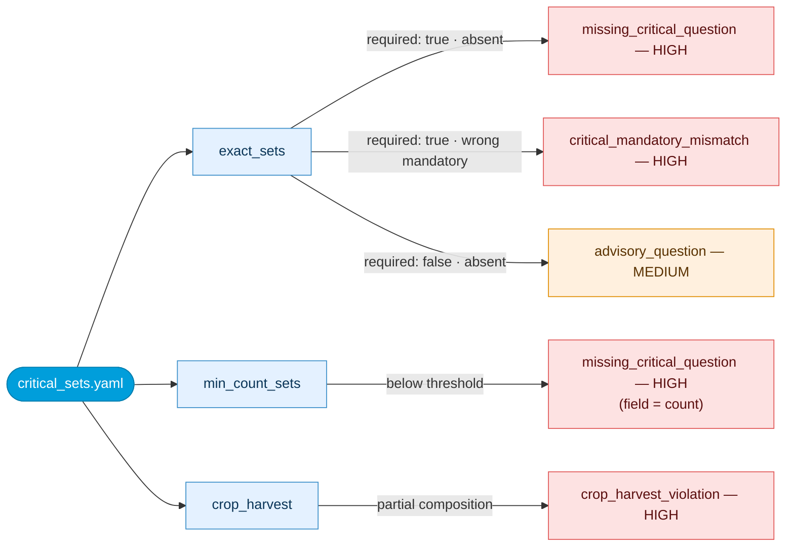
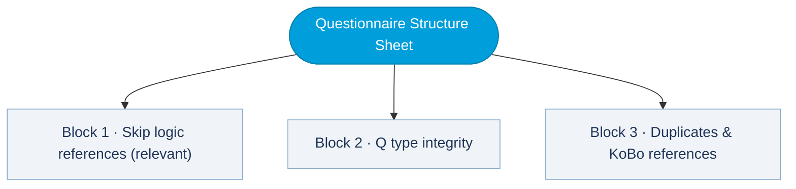
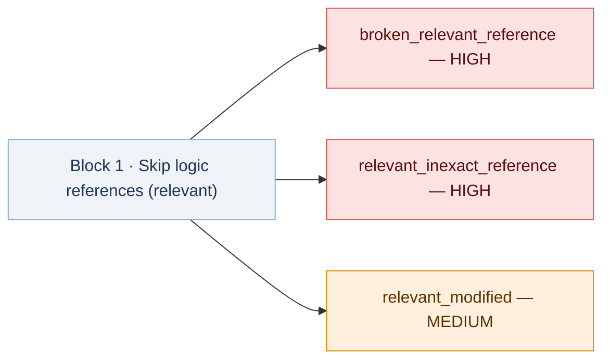
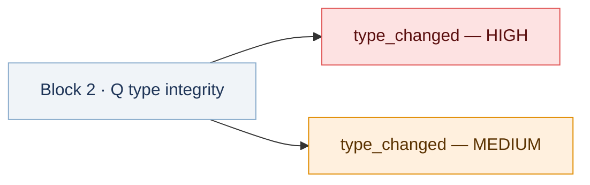
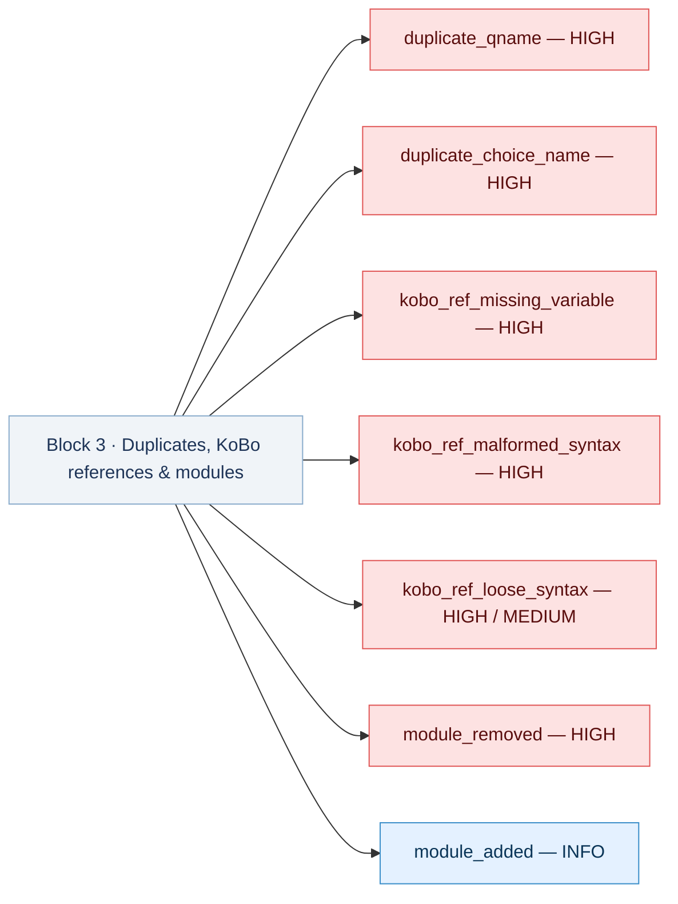
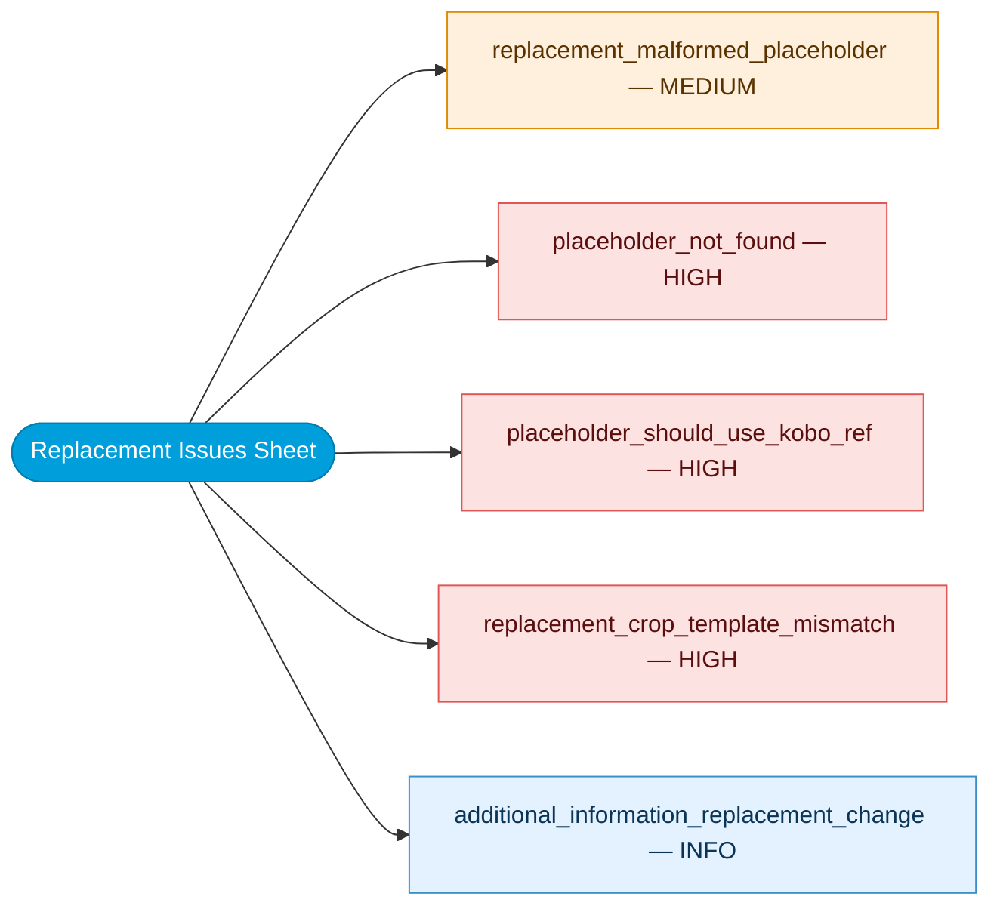
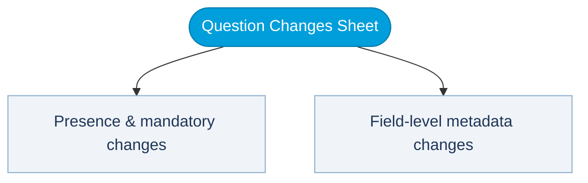
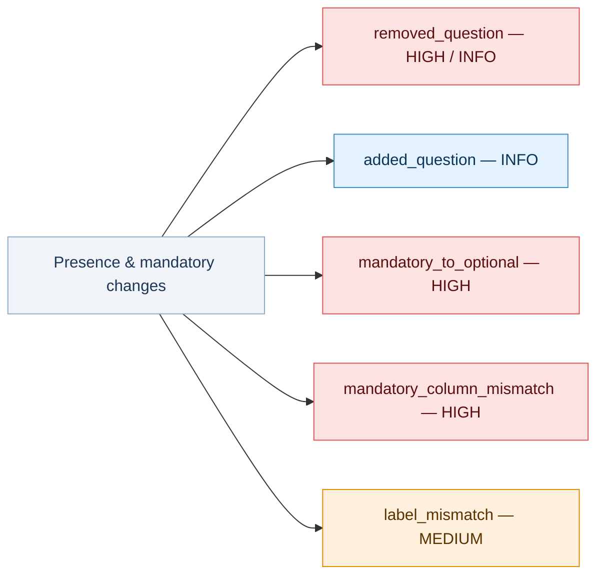
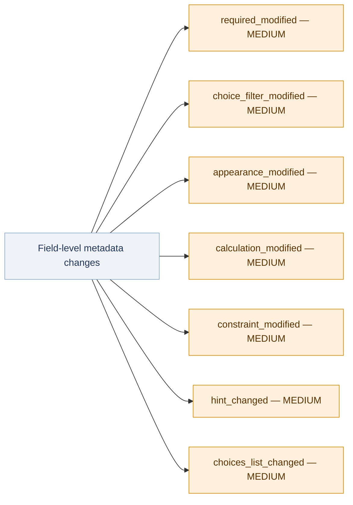
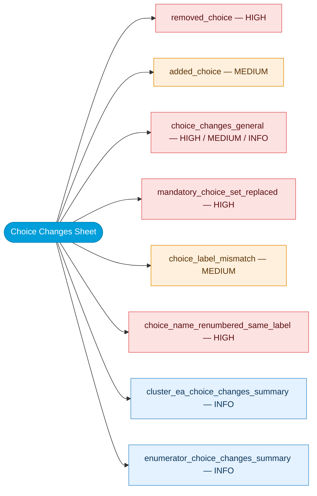

# KoBo Validation Logic

**Use this page alongside a real KoBo report.** Open the matching Excel sheet for each section below.

## Pipeline Context

Before any report row is produced, the validator completes four preparation blocks:

1. **Config and reference resolution**  -  load active config, resolve `latest_template` or `previous_round` baseline.
2. **Survey/choices parsing**  -  normalize XLSForm field structures and map language-specific labels.
3. **Placeholder and logic integrity checks**  -  evaluate `relevant` expressions, placeholder syntax, and replacement readiness.
4. **Issue synthesis and export**  -  write standardized issue rows and workbook sheets.

---

## 1  -  Summary Sheet

Aggregates all issue rows by severity and by check group. Read this first.

- Any `HIGH` issue means the questionnaire should not be launched until resolved.
- Use Summary to prioritize investigation, not for root-cause detail.
- Move to detail sheets for exact question/field evidence.
- Header context lines identify the exact run:
  `Comparison basis`, `Current questionnaire`, `Checked against`, `Language scope`, and `Template used for placeholder mapping`.

<strong>Screenshot to add:</strong> <code>docs/assets/images/reports/kobo-sum-config-header.png</code> — the run context rows at the top of the Summary sheet

{: .sheet-placeholder }

---

## 2  -  Critical Sets Sheet

Checks whether all required questions defined in `critical_sets.yaml` are present and have the correct mandatory behavior. If this layer fails, downstream analysis can be inconsistent across rounds.

### How rules are defined

`critical_sets.yaml` defines three distinct rule types. `exact_sets` lists named questions individually — each can be marked required (`required: true`) or advisory (`required: false`). A required question that is absent or incorrectly flagged as mandatory triggers a HIGH; an advisory one triggers MEDIUM. `min_count_sets` works on prefixes rather than individual names: it requires a minimum number of questions matching a given prefix to be present, and reports against the `count` field when the threshold is not met. `crop_harvest` checks form composition — the questionnaire must contain either the minimal or the full crop/harvest question set; partial inclusion is a structural violation.

**min_count_sets thresholds:** `hh_wealth_*` (or `o_hh_wealth_*`) ≥ 1 · `cs_stress_*` ≥ 4 · `cs_crisis_*` ≥ 3 · `cs_emergency_*` ≥ 3

**crop_harvest sets:** Minimal = `crp_harv_change` only · Full = `crp_harv_change` + `crp_harv_vol` + `crp_harv_unit` + `crp_harv_unit_kg` + `crp_harv_lastyr`

### Issue types

  

    <code>missing_critical_question</code>
    HIGH
    A required critical question is absent from the current form. Min-count deficits are also reported under this type (field = <code>count</code>). For WEALTH checks, <code>o_hh_wealth_*</code> is accepted as an alternative to <code>hh_wealth_*</code>.
  

  

    What to do
    Open the Critical Sets sheet and check the field column. If it shows <code>count</code>, the group has too few questions — restore enough questions to meet the minimum. If it names a specific question, that question is entirely absent — restore it or escalate for explicit removal approval before launch.
  

  

    <code>critical_mandatory_mismatch</code>
    HIGH
    A critical question is present, but its mandatory category no longer matches the configured expectation.
  

  

    What to do
    Check the Current value and Reference columns to see what changed. Update the mandatory column in the XLSForm to match the expected category, or confirm with the survey team that the change is deliberate and update the config accordingly.
  

  

    <code>advisory_question</code>
    MEDIUM
    A question listed in <code>critical_sets.yaml</code> with <code>required: false</code> is absent. These questions are not mandatory for the round to proceed, but they are tracked because they contribute to indicator coverage or data quality. The validator flags them so the omission is a conscious decision, not an oversight.
  

  

    What to do
    Check whether omitting this question affects indicator coverage or comparability for this round. If the omission is intentional, note it in the round documentation and move on — no fix required to proceed.
  

  

    <code>crop_harvest_violation</code>
    HIGH
    The crop/harvest structural completeness rule failed  -  neither the minimal nor the full allowed set is present.
  

  

    What to do
    Check the Critical Sets sheet for which crop/harvest questions are missing and compare against the allowed patterns in <code>critical_sets.yaml</code>. Restore the minimum required set before launch.
  

---

## 3  -  Questionnaire Structure Sheet

Validates `relevant` expression references, routing drift, duplicate names, and `${variable}` syntax. A single broken reference can hide entire question groups in the field  -  silent errors.

### How checks are structured

The sheet organizes its output into three independent check blocks. Each block targets a different class of structural problem — routing correctness, type compatibility, and naming integrity. The diagram below shows the split.

`#placeholder#` mapping problems are reported in **Replacement Issues**, not in this sheet.

### Block 1 · Skip logic references (relevant)

Each `relevant` expression is parsed to extract every variable it references, then those names are cross-checked against the full list of question names in the form. A missing name means the condition will always evaluate to false at runtime — that question group becomes permanently hidden without any error shown to the enumerator. Drift from the baseline is also tracked to catch unintended routing changes between rounds.

#### Issue types

  

    <code>broken_relevant_reference</code>
    HIGH
    A <code>relevant</code> expression references a question or variable not present in the form. The condition will fail silently at runtime.
  

  

    What to do
    Find the question in the sheet and check its relevant expression. The variable named in the expression does not exist in the survey — either correct the reference to point to an existing variable, or restore the missing variable before launch.
  

  

    <code>relevant_inexact_reference</code>
    HIGH
    The referenced variable name is not present exactly, but a close optional counterpart (for example <code>o_var</code>) exists. This is usually a mis-targeted routing reference.
  

  

    What to do
    Check whether the relevant expression should point to the optional variant (<code>o_var</code>) or whether the base question needs to be restored. Update the expression to use the correct variable name — routing to the wrong one will skip entire question groups silently.
  

  

    <code>relevant_modified</code>
    MEDIUM
    A <code>relevant</code> expression changed from baseline. Routing paths may differ from the previous round.
  

  

    What to do
    Compare the Current value and Reference columns. If the change reflects a removed or renamed question, verify the new routing still produces the intended skip logic. If the change is unexplained, align with the survey team before launch.
  

### Block 2 · Q type integrity

The validator normalizes both the current and reference `type` values before comparing — for example, `select_one` and `select one` are treated as equivalent. After normalization, it classifies the transition: incompatible changes (e.g. select_one to select_multiple, or a question with choices becoming a text field) are HIGH because they affect how KoBo stores and validates answers. Changes within compatible variants are MEDIUM.

#### Issue types

  
<code>type_changed</code>  -  severity is dynamic

  

    HIGH
    Incompatible or structurally invalid type transition (for example single-select to multi-select, or option-bearing to non-option with invalid option shape). Also includes missing current type when reference has a type, or unknown/unlisted type tokens.
  

  

    MEDIUM
    Type changed within compatible variants after normalization. Review for expected behavior consistency.
  

  

    What to do
    For HIGH rows: restore the original type or get explicit confirmation from the survey team that the new type is intentional, then test the form in KoBo before launch — incompatible type transitions can corrupt data structure. For MEDIUM rows: review whether the change is expected and confirm the data will still be comparable across rounds.
  

### Block 3 · Duplicates, KoBo references & modules

Three independent scans run here. The first looks for duplicate question and choice names — KoBo requires all names to be unique because they are used as identifiers in `relevant` expressions, constraints, and data exports. The second scans all text fields (labels, hints, constraints, calculations) for `${var}` references and checks whether each variable exists, whether the syntax is correct `${var}` form rather than the bare `$var` shorthand, and whether the `${...}` token itself is structurally valid (non-empty, properly closed). The third checks module-level structure: every module present in the template must also appear in the current form; any module present in the current form but absent from the reference is flagged informally for traceability.

#### Issue types

  

    <code>duplicate_qname</code>
    HIGH
    Duplicate question names break deterministic referencing in <code>relevant</code> expressions and in data joins.
  

  

    What to do
    Find both questions with the same name in the survey sheet and rename one. Duplicate names make relevant expressions and data joins unpredictable — fix before launch.
  

  

    <code>duplicate_choice_name</code>
    HIGH
    Duplicate choice names within one list can cause option collisions when the list is referenced by multiple questions.
  

  

    What to do
    Find the duplicated option names in the choices sheet for the list shown and rename one. Two options with the same name in one list will collide when the list is used by multiple questions.
  

  

    <code>kobo_ref_missing_variable</code>
    HIGH
    A <code>${var}</code> reference points to a variable not defined anywhere in the survey sheet.
  

  

    What to do
    The variable named in the <code>${...}</code> reference does not exist in the survey. Either restore the missing variable or correct the reference to point to an existing one before launch.
  

  

    <code>kobo_ref_malformed_syntax</code>
    HIGH
    A <code>${...}</code> reference token is structurally malformed — unclosed braces, empty variable name, or invalid characters inside the braces. KoBo silently ignores these at runtime.
  

  

    What to do
    Fix the token in the field shown. The correct format is <code>${variable_name}</code> with a non-empty variable name and both braces properly closed.
  

  
<code>kobo_ref_loose_syntax</code>  -  severity is dynamic

  

    HIGH
    Reference uses loose syntax like <code>$var</code> where <code>var</code> is an existing question name. Use <code>${var}</code>.
  

  

    MEDIUM
    Loose syntax is present but does not match an existing question name. Still normalize to <code>${var}</code>.
  

  

    What to do
    Replace <code>$var</code> with <code>${var}</code> in the field shown. For HIGH rows the variable exists and the loose syntax is actively dangerous — KoBo may not evaluate it correctly. For MEDIUM rows the variable name is unrecognized but the syntax is still invalid and should be corrected.
  

  

    <code>module_removed</code>
    HIGH
    A question module required by the template is absent from the current form. The module name in the Field column identifies which thematic block is missing.
  

  

    What to do
    Restore the missing module before launch, or get explicit approval for its removal. A missing module means an entire thematic block of questions will not be collected in this round.
  

  

    <code>module_added</code>
    INFO
    A module exists in the current form but was absent from the selected reference. Track for traceability.
  

  

    What to do
    Confirm the addition is intentional. If so, no action needed — document the new module in the round notes.
  

---

## 4  -  Replacement Issues Sheet

Checks placeholder consistency between the template, the current questionnaire, and the Additional Information sheet. Unresolved tokens appear as raw `#placeholder#` text to enumerators.

!!! info "Previous-round remap note"
    In `previous_round` mode, replacement-driven deltas are remapped to `additional_information_replacement_change (...)` with INFO severity and reported in this sheet.

### How checks are structured

Three classes of problem are reported here. The first is a malformed token: the survey text contains `#...#` syntax that is broken (unbalanced markers), so the token cannot even be parsed. The second is a missing or misrouted token: the survey text contains a valid `#placeholder#` but the Additional Information sheet has no matching key. The third is a structural mismatch: a token matches a live form variable but is written as plain text rather than `${variable}` KoBo syntax — meaning it will not resolve at runtime. In previous-round mode, replacement-driven label deltas are remapped here to avoid inflating Question Changes counts. In previous-round mode only, a `replacement_crop_template_mismatch` is also raised when the crop code/label pairing in the current form diverges from the template.

### Issue types

  

    <code>replacement_malformed_placeholder</code>
    MEDIUM
    A placeholder token in survey text is structurally malformed — unbalanced or broken <code>#...#</code> markers that cannot be parsed or resolved.
  

  

    What to do
    Fix the placeholder syntax in the field shown. The correct format is <code>#token#</code> with both hash signs present and no extra spaces or characters inside the markers.
  

  

    <code>placeholder_not_found</code>
    HIGH
    A placeholder token exists in survey text but has no usable replacement mapping in the Additional Information sheet.
  

  

    What to do
    Add the missing token to the Additional Information sheet with the correct replacement value, or correct the token spelling in the survey text to match an existing entry. An unresolved token will appear as raw <code>#placeholder#</code> text on the enumerator's device.
  

  

    <code>placeholder_should_use_kobo_ref</code>
    HIGH
    Text appears to be a variable reference but is written as plain text instead of proper <code>${variable}</code> KoBo syntax.
  

  

    What to do
    Replace the plain text reference with the correct KoBo syntax: <code>${variable_name}</code>. This token matches a survey variable — using placeholder syntax instead of a KoBo reference means the value will not resolve at runtime.
  

  

    <code>replacement_crop_template_mismatch</code>
    HIGH
    Crop code/label pairing in the current form diverges from the template baseline. This check runs only in <code>previous_round</code> mode during validated questionnaire production.
  

  

    What to do
    Check the Crop list sheet and compare crop codes and labels against the template. A mismatch here means the validated questionnaire output may contain incorrect crop placeholders — fix before distributing the validated file.
  

  

    <code>additional_information_replacement_change (...)</code>
    INFO
    Difference is replacement-driven (Additional Information / crop / AGOL context) and tracked here to avoid confusion in Question and Choice Changes.
  

  

    What to do
    This is a traceability record, not an error. Review the Current value and Reference columns to confirm the replacement content is correct for this round. No action needed if the replacement is expected.
  

---

## 5  -  Question Changes Sheet

Compares the current form against the reference question by question  -  presence, mandatory status, labels, and field-level metadata.  
Q type integrity is intentionally tracked in **Questionnaire Structure**.

### How checks are structured

Checks run in two passes. The first compares question presence and mandatory status — removals and mandatory changes affect data coverage and indicator completeness and carry the highest severities. The second pass compares field-level metadata for questions that appear in both files; these changes are all MEDIUM because they rarely affect coverage directly but can alter enumerator behavior, form validation, or data structure.

### Presence & mandatory changes

#### Issue types

  
<code>removed_question</code>  -  severity is dynamic

  

    HIGH
    Removed question is <code>mandatory</code> or <code>mandatory-panel</code> in the reference. Loss of a mandatory question breaks indicator calculation.
  

  

    INFO
    Removed question is optional in the reference, <em>or</em> was downgraded because the remaining group still satisfies the min-count threshold (prefix-count downgrade logic).
  

  

    What to do
    For HIGH rows: restore the question before launch or get explicit approval for its removal — a mandatory question missing will break indicator calculation for this round. For INFO rows: the removal is low-risk; document it if intentional and move on.
  

  

    <code>added_question</code>
    INFO
    A question exists in the current form but was not in the reference. Track for traceability.
  

  

    What to do
    Confirm the addition is intentional. Check whether it affects skip logic for surrounding questions or changes data comparability. No blocker — document the addition in the round notes.
  

  

    <code>mandatory_to_optional</code>
    HIGH
    A mandatory baseline question moved to optional counterpart. Coverage risk: the question may not be collected for all eligible households.
  

  

    What to do
    Confirm whether the downgrade to optional is intentional. If it is, assess the coverage impact — the question may not be collected for all households, which affects indicator comparability. If unintentional, restore the original mandatory question name.
  

  

    <code>mandatory_column_mismatch</code>
    HIGH
    The mandatory column/category value differs from the baseline expectation  -  the question's enforcement behavior changed.
  

  

    What to do
    Check the Current value and Reference columns. Update the mandatory column in the XLSForm to match the expected value, or confirm with the survey team that the change is deliberate and document it in the round notes.
  

  

    <code>label_mismatch</code>
    MEDIUM
    Question label text changed after normalization. Verify interpretive equivalence across rounds.
  

  

    What to do
    Read the Current value and Reference columns side by side. If the meaning is equivalent (minor phrasing refinement), no action needed. If the wording changed in a way that could shift respondent interpretation, align with the survey team before launch.
  

### Field-level metadata changes

#### Issue types

  

    <code>required_modified</code>
    MEDIUM
    The <code>required</code> field changed, which may affect form completeness enforcement.
  

  

    What to do
    Check whether the change is intentional. A field becoming not-required means enumerators can skip it; a field becoming required may block submission. Confirm the new behavior is correct before launch.
  

  

    <code>choice_filter_modified</code>
    MEDIUM
    The <code>choice_filter</code> logic changed, which may alter which answer options are shown to the enumerator.
  

  

    What to do
    Review the new filter expression and confirm it shows the correct options for expected input values. Test in KoBo with realistic data before launch — a wrong filter can silently hide valid answer options.
  

  

    <code>appearance_modified</code>
    MEDIUM
    Appearance metadata changed. Review for enumerator UX differences.
  

  

    What to do
    Check the new appearance value and confirm it renders correctly in KoBo Collect. Some appearance changes affect widget layout and usability — verify on a device before launch.
  

  

    <code>calculation_modified</code>
    MEDIUM
    A calculation expression changed, which may alter derived values in the collected data.
  

  

    What to do
    Review the new calculation expression and verify it produces the expected output for known inputs. Incorrect calculations produce wrong derived values in the dataset — test before launch.
  

  

    <code>constraint_modified</code>
    MEDIUM
    A constraint rule changed, which may alter input validation behavior for enumerators.
  

  

    What to do
    Check whether the new constraint correctly accepts valid inputs and rejects invalid ones. An over-strict constraint can block valid submissions; a too-loose one lets bad data through. Test in KoBo before launch.
  

  

    <code>hint_changed</code>
    MEDIUM
    Hint text changed. Review to ensure guidance quality and consistency with previous instructions.
  

  

    What to do
    Read both hint versions and confirm the enumerator guidance is still accurate and aligned with field protocols. If the hint was improved intentionally, no further action needed.
  

  

    <code>choices_list_changed</code>
    MEDIUM
    The linked choices list name changed for this question. The answer set may differ from the baseline.
  

  

    What to do
    Check what the new list contains and compare it against the old one. If the lists are equivalent (just renamed), no issue. If the options differ, assess the impact on data comparability across rounds.
  

---

## 6  -  Choice Changes Sheet

Compares option additions, removals, label drift, and choice-name renumbering for shared questions. Choice drift alters respondent interpretation even if the question stem looks unchanged.

!!! warning "Read Question Changes and Choice Changes together"
    If a question is removed, its choices will typically not appear as standalone choice removals. Always interpret both sheets in combination.

### How checks are structured

For each question that appears in both the current and reference form, the validator compares choice lists by list name and option name. Removed options affect data coding: respondents can no longer select a previously available answer, and historical data coded to that option will not match any current option. Added options introduce a new code that did not exist in previous rounds and may not be handled by existing data processing scripts. Label changes are tracked independently of option identity — an option can keep the same name while its displayed text changes. The validator also flags same-label choice-name renumbering (for example `4` changed to `3`) when mapping is one-to-one in both files. When a question has both additions and removals simultaneously, the individual rows are collapsed into a single `choice_changes_general` row. When zero label overlap is detected between the current and reference choice set for a non-country-specific question, a `mandatory_choice_set_replaced` is raised. Enumerator list changes are always suppressed into an informational summary row.

### Issue types

  

    <code>removed_choice</code>
    HIGH
    A baseline option was removed from the current choice list. Respondents can no longer select a previously available answer.
  

  

    What to do
    Confirm the removal is intentional. Check historical data — responses previously coded to this option will not match any current option, which breaks comparability for that answer category. Restore if unintentional.
  

  

    <code>added_choice</code>
    MEDIUM
    A new option exists only in the current choice list. Review for compatibility with historical data coding.
  

  

    What to do
    Confirm the addition is intentional and review how it will be coded in the data. New options without a matching historical code can break existing categorizations — document the addition and its intended coding scheme.
  

  
<code>choice_changes_general</code>  -  severity is dynamic

  

    HIGH
    A question has both options added and options removed in the same list. The row is a consolidated summary showing total counts and option names for both sides. Severity inherits HIGH when any underlying row was HIGH (i.e. when there are removals).
  

  

    What to do
    Read the Field column for the added and removed counts and expand the Current value and Reference columns to see the full before/after lists. Treat removed options as HIGH priority (data coding risk) and added options as MEDIUM. Confirm both sides are intentional before launch.
  

  

    <code>mandatory_choice_set_replaced</code>
    HIGH
    The entire choice set for this question was replaced — zero normalized-label overlap exists between the current and reference options. The current and reference lists share no recognizable answer options.
  

  

    What to do
    Check whether the choice list replacement was intentional. A complete list swap breaks historical comparability for this question entirely — all previous answer coding maps become invalid. If unintentional, restore the original choice list.
  

  

    <code>choice_label_mismatch</code>
    MEDIUM
    Option label text changed while the option identity still matches. Verify interpretive equivalence.
  

  

    What to do
    Read both label versions and check whether the meaning is equivalent. A minor phrasing clarification is fine. If the label change shifts what the option represents, assess the impact on data comparability across rounds.
  

  

    <code>choice_name_renumbered_same_label</code>
    HIGH
    The choice label stayed equivalent, but its <code>name</code> value changed (for example <code>4</code> to <code>3</code>). This changes data coding across rounds.
  

  

    What to do
    Confirm whether the renumbering was intentional. If not, restore the original choice names. If intentional, document the recode and update downstream cleaning/mapping scripts so historical comparability is preserved.
  

  

    <code>cluster_ea_choice_changes_summary</code>
    INFO
    Aggregate count of choice additions, removals, label changes, and renumbering on the cluster/EA question. This is a summary row — the individual changes are suppressed to avoid flooding the sheet with administrative area turnover rows that are expected between rounds.
  

  

    What to do
    Review the counts shown in the Current value column (added, removed, modified, renamed). If the turnover is unexpectedly high, cross-check the admin area list against the source data. No action needed when the numbers reflect expected area additions or retirements for this round.
  

  

    <code>enumerator_choice_changes_summary</code>
    INFO
    Enumerator list changes are suppressed into a single informational summary row. The Current value column shows how many enumerator choices are present in the current form; individual per-enumerator diffs are not written to the sheet because they vary by deployment site and are not meaningful for cross-round comparability.
  

  

    What to do
    No action needed unless the enumerator count is unexpectedly different from what is expected for this round. If so, check the enumerator list in the choices sheet directly.
  

---

## 7  -  Validated Questionnaire Output (Previous-Round Workflow Only)

Produced only when `reference_mode: previous_round` is configured. This is the final ready-to-use questionnaire file produced by the validator.

**What is built:**

- Crop choice lists rebuilt from the current `Crop list` sheet.
- Admin lists refreshed from AGOL where available.
- All placeholder tokens replaced in text fields.
- Final scan for remaining unresolved tokens before saving.

---

## Recommended Review Sequence

1. **Summary**  -  triage severity and identify blocked check groups
2. **Critical Sets**  -  confirm structural completeness
3. **Questionnaire Structure**  -  validate relevant logic and naming
4. **Replacement Issues**  -  confirm all placeholders are resolved
5. **Question Changes**  -  assess comparability risk
6. **Choice Changes**  -  verify answer-set stability
7. **Validated Questionnaire Output**  -  confirm deployment file quality (previous-round workflow only)
