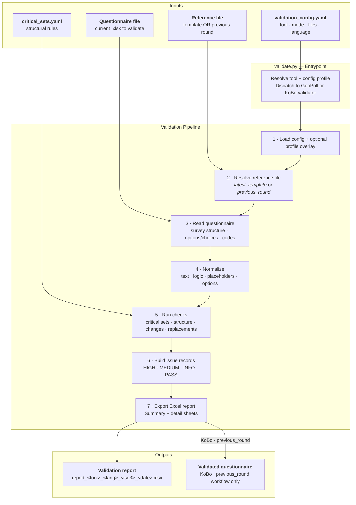

# Process Overview

Use this page as the main map of the validation pipeline — inputs, steps, and outputs.

## End-to-End Pipeline

---

## Shared Pipeline Steps

Both GeoPoll and KoBo validators follow the same 7-step macro flow.

**Step 1 — Load config**
: Reads `validation_config.yaml`. If `config_profile` is set, merges the profile overlay on top. This is the only place where run parameters are picked up.

**Step 2 — Resolve reference file**
: Determines the baseline questionnaire for comparison. Mode `latest_template` uses the newest matching file in `templates_dir`; mode `previous_round` uses `previous_round_file` under `working_dir`. See [Reference Modes](reference-modes.md).

**Step 3 — Read questionnaire**
: Parses the current questionnaire Excel file. GeoPoll reads survey rows with language-aware column resolution and extracts numbered options and code tokens. KoBo reads `survey` and `choices` sheets.

**Step 4 — Normalize**
: Normalization is critical to avoid false positives from harmless formatting differences.

- **Text normalization**: trims, lowercases, and standardizes comparison text.
- **Logic normalization**: canonicalizes skip/relevant expressions where possible.
- **Placeholder normalization**: resolves template markers using Additional Information sheet replacements.
- **Option normalization**: aligns option structures before diffing labels and presence.

**Step 5 — Run checks**
: Executes all configured rule families. Results from `critical_sets.yaml` rules are applied here alongside code-level structure and comparison checks.

**Step 6 — Build issue records**
: Converts raw diffs and rule failures into standardized issue rows. Each row gets an `issue_type`, a `severity` (HIGH / MEDIUM / INFO / PASS), metadata columns, and an action recommendation.

**Step 7 — Export report**
: Writes the Excel workbook. The Summary sheet aggregates by severity and check group. Detail sheets carry the full issue rows. KoBo in `previous_round` mode also produces a validated questionnaire output file.

---

## Tool-Specific Additions

=== "GeoPoll"

    - Language-aware column resolution (EN / FR / AR / ES / PT).
    - Option extraction from numbered text (`1) Label` format) and code-token parsing.
    - Skip-pattern consistency and option-code reference validation.
    - Crop/harvest structural completeness rule.
    - Report sheets: **Summary · Critical Sets · Questionnaire Structure · Replacement Issues · Question Changes · Option Changes**.

=== "KoBo"

    - `survey` and `choices` sheet parsing (XLSForm format).
    - `relevant` expression reference validation and modification tracking.
    - `${variable}` syntax and missing-reference checks.
    - Duplicate question and choice-name detection.
    - Report sheets: **Summary · Critical Sets · Questionnaire Structure · Replacement Issues · Question Changes · Choice Changes**.
    - In `previous_round` workflow: produces a validated questionnaire output file.
